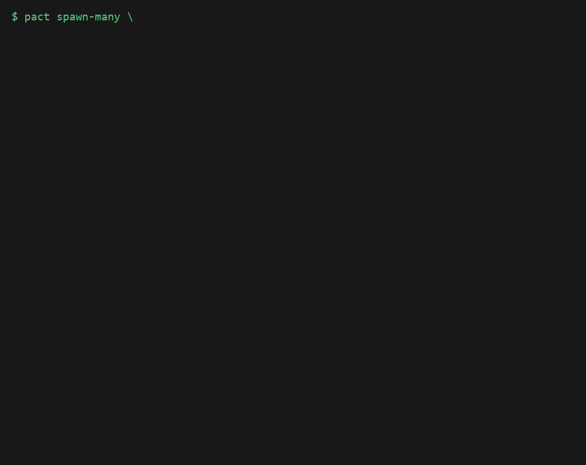
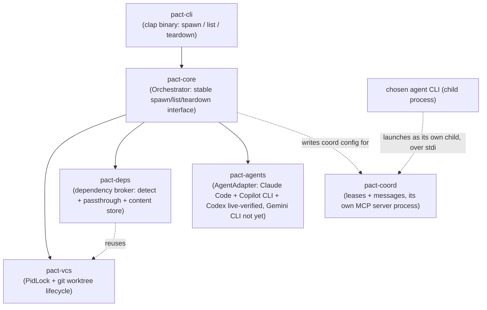
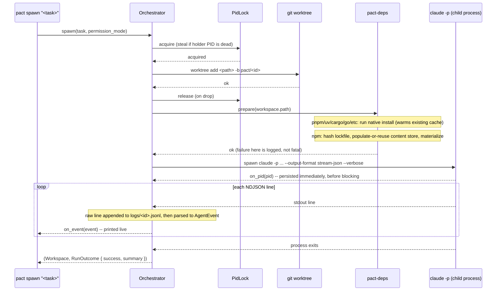
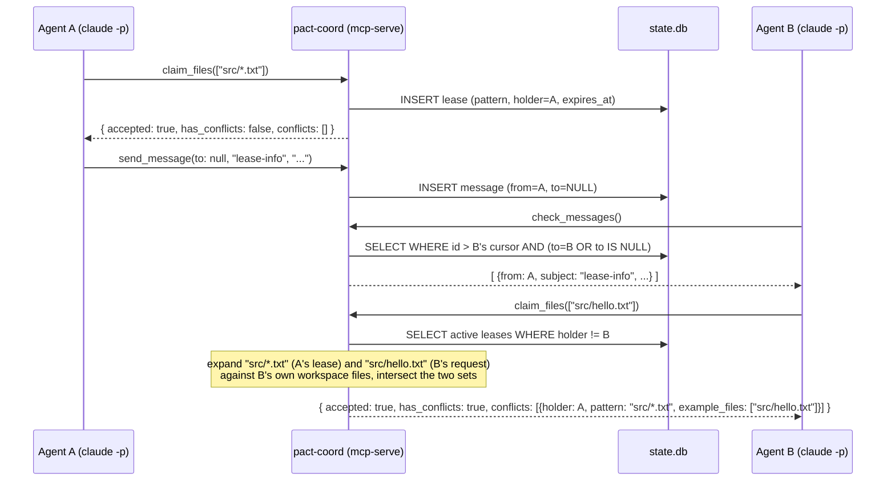

# pact

A language-agnostic orchestrator for running multiple AI coding agent CLIs
(Claude Code, GitHub Copilot CLI, Codex) in parallel on the same repository,
without them fighting each other.



**[Getting started guide](GETTING_STARTED.md)** -- install to watching two
agents work in parallel, in under 5 minutes, every command verified
end-to-end.

**Windows is a first-class target, not an afterthought.** Most tools in
this space (parallel git-worktree agent orchestration) are built on tmux,
which is POSIX-only and excludes Windows entirely. Pact ships a native
Windows binary and has real Windows-specific correctness work behind it --
`.cmd` shim resolution for npm/pnpm/yarn (`std::process::Command` doesn't
consult `PATHEXT` the way a real shell does), a `MAX_PATH` fallback for
the npm content store, and UTF-8 BOM handling for files written by
PowerShell's own default encoding. Verified on Windows 10/11 with
PowerShell 5.1, not just cross-compiled and assumed to work.

## Getting started

Download a prebuilt binary -- no Rust toolchain, no MSVC linker/Build
Tools install required:

```sh
# macOS (Apple Silicon)
curl -L https://github.com/zekariasasaminew/pact/releases/latest/download/pact-aarch64-apple-darwin.tar.gz | tar xz

# macOS (Intel)
curl -L https://github.com/zekariasasaminew/pact/releases/latest/download/pact-x86_64-apple-darwin.tar.gz | tar xz

# Linux (x86_64)
curl -L https://github.com/zekariasasaminew/pact/releases/latest/download/pact-x86_64-unknown-linux-gnu.tar.gz | tar xz
```

```powershell
# Windows (x86_64)
Invoke-WebRequest https://github.com/zekariasasaminew/pact/releases/latest/download/pact-x86_64-pc-windows-msvc.zip -OutFile pact.zip
Expand-Archive pact.zip
```

`latest` above always points at the most recent tagged, versioned
release. To try unreleased work on `main` before the next tag (e.g. a
just-merged fix) without building from source, download the same way
from the [`edge` release](https://github.com/zekariasasaminew/pact/releases/tag/edge)
instead of `latest` -- it's rebuilt automatically on every push to `main`
via `.github/workflows/edge-release.yml`, so the tag and its assets move
constantly. **Not a stable release channel** -- for anything you depend
on, use a tagged `vX.Y.Z` release.

Then, from inside (or with `--repo` pointing at) a git repository:

```sh
./pact spawn "implement the thing"
```

See [Usage](#usage) below for the full command surface. Building from
source instead (e.g. to contribute) is covered in
[CONTRIBUTING.md](CONTRIBUTING.md).

## The problem

Running several coding agents at once on one repo hits three separate kinds
of pain, in this priority order:

1. **Dependency installs don't share.** Every `git worktree` starts with no
   `node_modules`/venv/etc., so each agent reinstalls from scratch.
2. **Agents can't tell each other anything.** There's no way for one agent
   to say "I just changed a function your task depends on" before the other
   finds out the hard way at merge time.
3. **Agents step on each other's files.** Two agents editing the same file
   in parallel is either avoided by manually partitioning work up front, or
   discovered as a merge conflict after the fact.

`git worktree` solves isolation but wasn't built for any of these three —
it was built for one human checking out a second branch, not an
orchestrator spinning up and tearing down N agent sandboxes per session.

## Design decisions

This section exists because the decisions below came from research and
back-and-forth discussion, not defaults — the reasoning is worth keeping
visible so it isn't silently re-litigated later.

### git worktree, not Jujutsu (jj)

Jujutsu's workspace model (`jj workspace add`) looks, on paper, like the
better fit: a lock-free operation log built for exactly this kind of
concurrent, multi-workspace use, plus first-class non-blocking conflicts.
It was seriously considered, including a real bug in Claude Code itself —
[anthropics/claude-code#34645](https://github.com/anthropics/claude-code/issues/34645)
— where concurrent `git worktree add` calls race on `.git/config.lock` and
fail, which is exactly the class of problem jj's operation log is designed
to avoid.

It was ruled out after a hands-on spike, not a documentation read:

- `jj git init --colocate` gives real git-command transparency, but only to
  the **one primary workspace**.
- `jj workspace add` — the feature that would let an orchestrator cheaply
  spin up N parallel agent workspaces — creates a directory with **no
  `.git` at all**. Confirmed directly: `git rev-parse --show-toplevel` run
  inside one silently climbed the directory tree and attached itself to an
  unrelated ancestor repository instead of erroring.
- The one documented workaround (a `.git` file with a `gitdir:` pointer)
  restores git *reads* only. Its own author's warning: git *writes* (add,
  commit, checkout, reset, stash) inside that workspace mutate the *main*
  repo's shared index/HEAD directly.

Since Claude Code, Copilot CLI, and Codex all write via native git
constantly — not occasionally — that's not an edge case, it's a
guaranteed collision, just moved one layer down and made silent instead of
loud. The bug that motivated considering jj is real, but the fix belongs in
the orchestrator's own locking (see `pact-vcs` below), not in swapping
the VCS.

### Rust

Matches the class of tool this is (uv, Codex CLI itself are both Rust):
precise control over hardlink/reflink/copy-fallback filesystem semantics,
a small static binary, and a concurrency model suited to supervising
several child processes at once.

### Dependency sharing leans on what already exists

Most package ecosystems already solved global dependency sharing — Cargo,
Go modules, Maven, Gradle, uv, pnpm, yarn, poetry, and pipenv all use a
global content-addressed or version-keyed cache by default. The gap is
narrower than "no ecosystem shares dependencies": it's specifically plain
npm (flat, per-project `node_modules`) and plain pip/venv. So
`pact-deps` (Phase 1) detects the package manager and passes through
to the ecosystem's own cache where one already exists well
(`passthrough.rs`), and only builds its own lockfile-hash-keyed content
store for the ecosystem that doesn't (`store.rs`, npm only).

Plain pip/venv was *also* a candidate for a custom store, and was
deliberately rejected, not deferred by accident: Python venvs aren't
reliably relocatable (activation scripts, `.pth` files, and console-script
shebangs can embed absolute paths tied to the original venv), so
hardlinking `site-packages` into a fresh venv is a correctness risk, not
just extra engineering — the same category of problem that justified
spiking jj before committing to it. Since pip already has its own global
download cache (`~/.cache/pip`) covering the expensive part (network
fetch), the remaining gap is bounded and left as future work.

**A sharper risk surfaced during an independent plan review before this
store was built, not after:** a plain *writable* hardlink means every
workspace's copy is the same underlying file record as the store entry —
so a package that writes into its own installed files post-install (a
native build step, a binary downloader, a git-hook installer) would
silently corrupt every other workspace, present and future, materialized
from that hash. `ContentStore::materialize` prefers reflink (copy-on-write,
safe under mutation by construction) and falls back to a hardlink marked
**read-only** at the destination, not a plain one — turning that failure
mode loud (the write fails) instead of silent (the store quietly rots).
One consequence worth knowing: because NTFS (and most filesystems) key
basic attributes to the underlying file record rather than the individual
link, marking a hardlink read-only also freezes the canonical store entry
itself after first use.

If a workspace's repo has no committed `package-lock.json` at all, npm
install still runs (so the agent has working `node_modules` from the
start) but with `--no-package-lock`, and the content store is skipped —
there's no stable lockfile hash to key a shared cache on, and letting each
workspace generate its own lockfile independently would otherwise show up
as a spurious merge conflict on `package-lock.json` at `merge-all` time
even when the two workspaces touched entirely disjoint source files.

### Signaling scope for v1

Advisory, glob-based, TTL-expiring file leases plus a threaded message log
between agents — the same shape validated at real scale (40-50 concurrent
agents) by prior art ([MCP Agent Mail](https://mcpagentmail.com/)). Deep
semantic/AST-based "this changed a function signature used by X" analysis
is deliberately out of scope for v1: it's language-specific by nature,
which cuts against the language-agnostic goal, and it's a large amount of
scope for a v1. It's a plausible future direction once the basic lease/
message loop is proven, not a v1 requirement.

Leases are advisory by design, not enforced: `claim_files` is granted
regardless of conflicts it finds, same as prior art. What isn't a minor
detail is *how* overlap is detected -- two glob patterns can look nothing
alike as strings and still cover the same files (`src/**/*.rs` vs
`src/foo.rs`), so `pact-coord` expands both patterns against the
actual files in a workspace and intersects the resulting sets, rather than
comparing pattern strings. Verified against exactly that case, not just
identical patterns: one agent claimed `src/*.txt`, a second claimed the
narrower `src/hello.txt`, and the conflict was correctly detected and
reported with the specific overlapping file named.

`check_messages` never returns a message the calling agent sent itself --
direct messages already excluded anything not addressed to the caller, and
broadcasts are now excluded the same way, so an agent that broadcasts a
status update and then polls in a loop doesn't see, and react to, its own
broadcast.

The coordination database is deliberately *not* stored alongside
per-workspace bookkeeping in `.pact-<repo>/` (see State layout) --
that directory sits one level above every workspace
(`workspaces/<id>/../..`), and headless launches default to
`bypassPermissions`, so a careless broad shell command in any one agent's
workspace could otherwise reach and corrupt coordination state every other
agent depends on. It now lives under the platform's local data directory
instead, keyed by a hash of the repo root. Not a hard security boundary --
an agent's Bash tool can still reach an absolute path -- but it removes the
realistic risk of stumbling into it by accident via `../..`. Found by
independent plan review before this was built, not after.

`rmcp` (the official Rust MCP SDK) requires an async runtime. Rather than
making the whole CLI async for this one server, it runs as its own OS
process (`pact mcp-serve`, launched by the agent CLI itself over
stdio, not run in-process by the orchestrator), and that subcommand builds
its own `tokio::Runtime` just for its own lifetime -- `spawn`/`list`/
`teardown` stay exactly as synchronous as before. Same reasoning as the
process-supervision decision below.

### The orchestrator must own workspace creation

A consequence discovered during the jj spike, not an arbitrary choice: this
tool has to create each workspace and launch **one agent process into it
itself**. It can't lean on an agent CLI's own built-in parallelism (Copilot
CLI's `/fleet`, Claude Code's Task-tool subagents-with-worktrees), because
that would mean two independent orchestration layers fighting over the
same repository.

### Process supervision stays synchronous for now

Everything in the codebase is blocking `std::process::Command`, including
Phase 2's agent launch -- `tokio` was declared as a workspace dependency
from the initial scaffold but is still unused. Introducing it just for one
adapter would mean either a half-async codebase or forcing every existing
blocking call through `spawn_blocking` for no present benefit, since only
one child process runs per `spawn` today. The seam that will matter is
structural, not sync-vs-async: process supervision lives entirely behind
`pact_agents::run_and_stream`, so whichever phase first needs to
supervise several *running* agents concurrently can change what's behind
that boundary without touching adapters or the orchestrator's call site.

### Headless safety defaults differ by adapter -- verified, not assumed

There's no TTY in headless mode to answer an interactive permission
prompt, so *some* unattended-safety setting is mandatory for every agent
CLI. What that setting should default to was investigated empirically
(issue #2), not assumed from docs, and the answer turned out to be
different per adapter:

- **Claude Code has a real, safer, non-hanging default.** Confirmed
  directly: an explicit `--allowedTools` list (covering file
  read/write/edit/search plus the VCS and package-manager commands
  `pact-deps` already knows how to prepare -- `git`, `npm`, `pnpm`,
  `yarn`, `cargo`, `go`, `pip`, `uv`, `mvn`, `gradle`), combined with
  Claude Code's own baseline permission mode (not `bypassPermissions`),
  makes an out-of-scope tool call get **denied cleanly and immediately**
  rather than hang -- the agent adapts and keeps working with whatever it
  *is* allowed to do. This is `pact`'s default for Claude Code now.
  Earlier documentation here claimed no mode short of `bypassPermissions`
  could avoid hanging; that was right about permission-mode alone, but
  incomplete -- it's specifically an explicit tool allowlist that unlocks
  safe non-interactive denial, independent of which permission mode is
  active.
- **Copilot CLI and Codex don't have a confirmed safe-and-functional
  alternative, so they keep their bypass-flag defaults.** Copilot CLI's
  `--allow-tool` works for in-scope actions, but confirmed directly: a
  task needing a tool outside that list **hangs** (not a clean deny) --
  its non-interactive mode doesn't have the same auto-deny fallback
  Claude Code's does. Codex's `--sandbox workspace-write` alone doesn't
  hang, but it also can't write files at all in headless mode, which
  defeats the point of running it. Shipping either as a "safer default"
  without that being true would repeat exactly the mistake found and
  fixed in the Codex adapter (documentation presented as fact, unverified)
  -- so both keep `--allow-all-tools` /
  `--dangerously-bypass-approvals-and-sandbox` for now, stated plainly as
  a real, asymmetric gap rather than smoothed over.

Every launch prints a warning naming exactly what the adapter's active
setting permits (not just which flag string is in effect), and `--safety`
is an explicit, overridable flag either way -- see "What can an agent
actually do to my machine?" below.

### What can an agent actually do to my machine?

- **Claude Code (default)**: read/write/edit files anywhere in its
  workspace, and run `git`/`npm`/`pnpm`/`yarn`/`cargo`/`go`/`pip`/`uv`/
  `mvn`/`gradle` commands. Anything else (an arbitrary shell command, a
  tool outside that list) is denied automatically -- the agent will work
  around the denial rather than stall.
- **Copilot CLI (default), Codex (default), and Gemini CLI (default)**:
  can run *any* shell command and edit *any* file the OS-level user
  running `pact` can reach, with no restriction. This is not a hardening
  choice -- it's the only configuration confirmed to actually get work
  done in headless mode for Copilot CLI and Codex; for Gemini CLI it's
  the only thing that could be *stated with confidence* won't hang,
  since this environment has no Gemini auth configured to actually test
  a safer mode against (see the Gemini adapter section below). Treat any
  of these three with the same trust you'd give a script you ran with
  your own full user permissions, because that's effectively what it has.
- All four: `--safety <value>` overrides the default in that adapter's
  own vocabulary (Claude Code's `--permission-mode` values, Codex's
  `--sandbox` values, Gemini CLI's `--approval-mode` values; Copilot CLI
  has no gradient to override).

### One AgentAdapter trait, not one unified safety enum

Phases 0-3 built exactly one adapter (Claude Code) without the
abstraction; `AgentAdapter` (Phase 4) was introduced once a second and
third real case existed to generalize against, not designed speculatively
in advance. The trait deliberately does *not* try to unify each CLI's
safety/approval vocabulary into one shared enum: Claude Code's
`--permission-mode` has six values, Copilot CLI's is a binary on/off with
no gradient at all, and Codex's real, confirmed shape turned out to be one
all-or-nothing flag (`--dangerously-bypass-approvals-and-sandbox`) rather
than the two independent `--sandbox`/`--ask-for-approval` axes OpenAI's
docs implied -- `--ask-for-approval` doesn't exist in the installed
version's `codex exec --help` at all. `build_command` takes a raw string
passed straight through to whichever vocabulary the chosen adapter uses,
rather than a shared type that would either lose expressiveness or need
constant extending as a fourth CLI's vocabulary inevitably differs again.

What *is* shared is `CoordConfig` -- what to tell an agent CLI about the
coordination server (name/command/args) is adapter-agnostic, even though
*how* to hand it over isn't: Claude Code and Copilot CLI both confirmed
the identical `{"mcpServers": {...}}` JSON-file-plus-flag shape, while
Codex takes inline `-c mcp_servers.<id>.*` config overrides instead and
needs no file at all -- confirmed working end-to-end, including a real
`claim_files` call through this project's own coordination server.

Codex's adapter was initially built from OpenAI's documentation alone (the
machine this project was first built on didn't have `codex` installed),
and was upgraded to live-verified once it was actually installed and run:
the documented `--ask-for-approval` flag turned out not to exist, and had
to be replaced with the confirmed-working bypass flag above. That's the
concrete reason this project treats "docs-only" and "live-verified" as
different claims, not a formality -- the docs were wrong on the
one flag that mattered most. One risk avoided along the way regardless:
Codex's normal MCP config mechanism is a `$CODEX_HOME/config.toml` file,
but `CODEX_HOME` also relocates auth/session state, not just config --
pointing it at a per-workspace directory would plausibly break headless
login on first use. The inline `-c` override sidesteps that entirely, and
was confirmed to actually connect to and call a real MCP server.

### Gemini CLI adapter: real CLI facts, blocked on live-verification

A fourth adapter, built from a real installed `gemini` CLI
(`@google/gemini-cli` 0.50.0) rather than documentation alone -- but
**not live-verified against a real authenticated session**, because this
environment has no Gemini API key or Google Cloud auth configured, and
`gemini -p "..."` fails immediately with `Please set an Auth method...`.
Completing a Google OAuth login on the user's behalf wasn't attempted --
that's an identity/credential decision that isn't this project's to make
autonomously.

What *is* confirmed by actually running the CLI, not guessed from docs:
`-p`/`-o stream-json` for headless streaming output, and a third
MCP-config mechanism among the four adapters -- confirmed by
running `gemini mcp add --scope project` and reading the file it wrote.
Gemini CLI reads `.gemini/settings.json`, relative to its own working
directory, automatically; no CLI flag hands it over at all, unlike Claude
Code/Copilot CLI's file-plus-flag shape or Codex's inline `-c` overrides.
The file's shape is identical to Claude Code/Copilot CLI's
`{"mcpServers": {...}}` (the same `write_mcp_json_config` helper works
unchanged), just written to a different, fixed path. Confirmed
end-to-end short of authentication: a real `pact spawn --agent gemini`
run against a scratch repo correctly wrote the MCP config into the
workspace before launching, and `gemini` failed with its own real auth
error (exit code 41) rather than pact hanging or crashing -- `pact`
reported it as a clean `failed` outcome using the process's actual exit
code, the same fallback Codex's missing Result-event schema already
relies on.

What's unconfirmed: the streaming JSON event schema (`parse_line`
is modeled on the shape common to the other three adapters, deliberately
defensive -- anything unrecognized surfaces as `Other` rather than being
dropped, precisely because this guess *will* need correcting once run for
real) and whether a safer approval mode hangs in headless mode the way
Copilot CLI's does or denies cleanly the way Claude Code's does. Default
safety is `--approval-mode yolo` -- not claimed as a verified safer
option, the same honest category Copilot CLI and Codex are already in.
This adapter stays open as issue #9 rather than closed, until it can
actually be run against a real session and upgraded to live-verified the
same way Codex was.

### Real parallel launch: OS threads, not async/tokio

Phase 2 deliberately kept process supervision synchronous, flagging that
whichever future phase first needed to supervise several agents
concurrently *in one process* would need to change what's behind
`pact_agents::run_and_stream`'s boundary. That phase is this one. The
choice of *how* -- OS threads vs. converting to async/tokio -- was
researched properly before deciding: two independent passes built the
strongest case for each side, then rebutted each other's case directly,
rather than picking the familiar option by default.

**Threads won.** The deciding factor was shape: `spawn-many` runs a fixed,
small, user-enumerated set of children to completion with combined
attributed output -- the same shape as Go's `overmind`/`goreman`
(goroutine-per-process), not the many-tasks-over-few-workers scheduler
shape that actually justifies `cargo-nextest`'s or Turborepo's tokio use.
Async's two concrete technical arguments didn't survive rebuttal: a crate
called `command-group` gives whole subprocess-tree containment (POSIX
process groups, Windows Job Objects) to plain `std::process::Command`,
with tokio as an *optional* feature only -- neutralizing the one
scale-independent advantage async had. The async sketch also had an
unacknowledged blocking-call-in-executor problem (synchronous log-file
writes inside an "async" task), and its claim that wrapping single-`spawn`
in a fresh `Runtime::new()?.block_on(...)` was "free" overstated its own
precedent (`mcp-serve`'s isolated runtime is a one-off subcommand, not
every `spawn` invocation). The one surviving async argument -- "pact's
roadmap includes more adapters and pluggable coordination, pay the async
cost now" -- was speculative in exactly the way this project has avoided
elsewhere (`AgentAdapter` was only introduced once a second and third real
adapter existed, not designed in advance of needing it).

One improvement fell out of this research regardless of which side won:
`command-group`'s whole-tree containment also closes a real gap the
*single*-agent Ctrl-C path already had. Before this, interrupting a live
`pact spawn` only killed the tracked agent process itself via plain
`Child::kill()` -- a Bash tool call's child shell (and anything *it*
started) kept running, silently holding the workspace directory open.
Confirmed directly: killing a `cmd.exe` process group with a running
grandchild `ping.exe` underneath it took the grandchild down too (see
`pact-agents/examples/group_kill_check.rs`, a manual Windows-only
verification harness, not part of CI). `teardown`'s Windows `taskkill /T`
already had this property; live Ctrl-C during `spawn` did not, until now.

A second improvement, closing part of a documented known limitation:
since every agent is now spawned via `command_group`'s `process_group(0)`,
it becomes its own process group leader on Unix, meaning its pgid equals
its pid. That means the `agent_pid` `pact` already persists to disk (so a
`teardown` invoked from a *different* process than the one that spawned
the agent can find it) is, by itself, enough to kill the whole group
cross-process: `kill(-pid, SIGKILL)`. Implemented in `pact-vcs` from
documented POSIX semantics and `command_group`'s own source, but --
per issue #6 -- not yet exercised on real Unix hardware, since this
project's dev environment is Windows-only. Treat as
implemented-not-live-verified until that happens.

**What stayed synchronous.** `pact-core`, `pact-vcs`, and `pact-deps` are
untouched -- no tokio anywhere outside `pact-cli`'s `mcp-serve` runtime and
`pact-coord`. `Orchestrator::spawn_many` shares one new `Supervisor` (a
registry of live child process groups plus a single process-wide Ctrl-C
handler, installed once) across `std::thread::scope`-spawned threads, one
per task; single-`spawn` creates its own single-use `Supervisor`, so its
observable behavior -- one handler, one child, installed and torn down
within one call -- is unchanged. The concurrency this relies on
(`create_workspace` and `pact_deps::prepare` running from several threads
at once) already existed and was already verified: it's the same
`PidLock`-guarded serialization Phase 0 confirmed against 6 concurrent
`spawn` calls, not new synchronization added for this phase.

### Teardown refuses on uncommitted changes now -- confirmed it didn't before

This was a real, confirmed data-loss bug, not a hypothetical gap the issue
speculated about. Reproduced directly: spawned a real workspace, added an
uncommitted file to it, ran `pact teardown`, and the file was silently
gone afterward -- no warning, no prompt, nothing. Root cause:
`pact-vcs::remove_worktree_retrying` always called
`git worktree remove --force`, which unconditionally bypasses a protection
git itself already has -- confirmed separately that plain
`git worktree remove` (no `--force`) refuses outright on that same dirty
worktree (`fatal: ... contains modified or untracked files, use --force to
delete it`). Every `pact teardown` had been silently defeating that
protection since Phase 0.

The fix mirrors git's own convention rather than inventing a new one:
`teardown` now checks `git status --porcelain` first and refuses by
default on any uncommitted change, printing exactly what's there; a new
`--force` flag proceeds anyway. This is deliberately separate from the
existing `--keep-branch`: working-tree dirt (never committed, not in
git's object database at all) is the actual unrecoverable-data-loss risk;
a committed-but-unmerged branch is lower severity, since its tip stays
reachable via reflog for a while even after `-D`, and `--keep-branch`
already exists for anyone who wants it kept around deliberately.

`pact diff <id>` (new) and a `[dirty]`/`[clean]` indicator on `list` round
out the rest of this phase's acceptance criteria -- seeing what an agent
actually did (both committed-on-branch and still-uncommitted) before
deciding whether to keep, discard, or manually merge it. `accept`/`reject`
verbs were deliberately not built: auto-merging multiple agents' output is
explicitly out of scope for this issue, and a thin `accept` that just
shells out to `git merge`/`cherry-pick` doesn't add enough over doing that
directly once `diff` has shown what's there.

### Store keying grew two dimensions, and gained a real fallback -- both found by risk analysis, one confirmed by a real failure

The npm content store's original key (`{os}-{arch}-node{major}-{lockfile
hash}`) had two real gaps, found by working through concrete failure
scenarios rather than assuming the existing dimensions were enough:

- **npm version wasn't part of the key**, so two workspaces on machines
  with different globally-installed npm versions, hitting the same
  lockfile hash, would share a store entry populated by whichever ran
  first -- even though different npm versions can lay out `node_modules`
  differently from an identical lockfile. Fixed: npm's own version is now
  in the key.
- **libc flavor (Linux only) wasn't part of the key.** Packages that
  resolve a platform-specific binary via `optionalDependencies` (`esbuild`,
  `swc`, `sharp`, and others in that exact shape) pick a *different* one
  for musl (Alpine) vs. glibc (Debian/Ubuntu) despite both reporting the
  same `os=linux, arch=x86_64` -- a real risk in the common case of mixed
  Alpine/Debian Docker-based dev environments, not an edge case. Fixed:
  a `-musl`/`-glibc` suffix, detected via the presence of musl's dynamic
  linker, is now in the key on Linux.

**The more consequential gap, and the one a real failure confirmed rather
than just a risk analysis predicting it:** `prepare_npm` previously had a
fallback to a plain, unshared `npm install` only when there was *no
lockfile at all* -- if a lockfile existed but store *population* itself
failed (`npm ci` erroring inside the store's staging directory), the
error was logged and the workspace was left with no `node_modules` at
all, not a normal install. Verified live, and this surfaced a genuine,
previously-unknown failure mode in the process: on Windows, populating a
store entry for `esbuild` (a package with a postinstall step) failed with
`ENOENT` spawning `cmd.exe` -- not because `cmd.exe` was missing, but
because the fully-qualified path exceeded Windows' `MAX_PATH` (260 chars)
once nested under the store's own (necessarily long, hash-containing) key
directory inside an already-long state-dir root. `prepare_npm` now
catches a population failure and falls back to a plain per-workspace
install (confirmed to succeed where the store population didn't, since
its path is shorter), logging why -- exactly the "falls back... instead of
trying to force it" behavior this issue asked for, exercised by a real
failure rather than a synthetic one.

**On the test matrix:** this project's dev environment is Windows-only
(confirmed: no APFS/ext4/btrfs access, only one local NTFS volume to test
against) -- the same honest constraint as issue #6. The cross-filesystem/
unsupported-FS fallback path (reflink -> hardlink -> plain copy) was
verified by reading `detect_link_mode`/`link_one`'s logic, not by
constructing an actual cross-filesystem scenario, since a second real
filesystem wasn't available to test against here.

### Cross-workspace conflict detection is informational, not blocking

MCP leases are advisory by design (`claim_files` grants regardless of
overlap it finds -- see the coordination-flow design decision above), and
this deliberately extends that same philosophy rather than inventing a
stricter standard just for this check. `pact conflicts` (and an automatic,
non-blocking warning before `teardown` removes a workspace) reports files
touched by more than one active workspace that share a common
merge-base -- but nothing here blocks anything. Running several agents at
similar tasks on purpose, then discarding whichever result is worse, is a
legitimate and common way to use `spawn-many`; blocking teardown on "another
workspace also touched this file" would fight that workflow instead of
supporting it. This is separate from `teardown`'s *existing* blocking
check (issue #4, uncommitted changes) -- that one stays exactly as it was.

Each reported conflict links back to coordination context for free: a
workspace's id is the same string as its MCP `agent_id`, so any lease
(active or expired -- a lapsed-but-relevant claim is still useful context,
not noise to filter) whose glob matched the file, and how many
coordination messages exist involving the workspaces in question, join
directly with no new plumbing. Detection itself stays at the file-path
level, the same restriction the README already states for leases --
semantic/AST-level analysis is still out of scope for v1.

### Coordination server is pluggable at the command level, not protocol-compatible with anything specific

Evaluated first, per this issue's own framing, whether pluggability was worth building at all: MCP Agent Mail (the prior art cited elsewhere in this README, running at 40-50 concurrent agents) has its own tool shapes, not literally pact-coord's `claim_files`/`release_files`/`send_message`/`check_messages` contract -- so "plug in MCP Agent Mail" was never actually one config flag away, and building a translation layer between differing MCP tool shapes for a scaling problem nobody's confirmed hitting yet (this project hasn't soft-launched -- see issue #12) would be exactly the kind of premature abstraction avoided elsewhere in this codebase (`AgentAdapter` was only generalized once a second and third real adapter existed).

What *was* worth doing: today, the coordination server's command was hardcoded to pact's own binary with no way to override it at all, even for someone willing to speak pact-coord's exact contract themselves (a hardened or custom reimplementation of the same lease/message API). `spawn`/`spawn-many --coord-command <path> --coord-arg <arg>` (repeatable) now override what gets written into the generated MCP config -- confirmed end-to-end: the resulting `{"mcpServers": {...}}` file correctly carried the overridden command/args instead of `pact mcp-serve`, and the existing coordination-status warning correctly reported the (deliberately nonexistent, for the test) alternative server as `failed` rather than silently accepting it. Pact does zero protocol translation either way -- whatever this points at must speak pact-coord's contract on its own.

**What the built-in server provides, for anyone evaluating an alternative:** advisory glob-based file leases with TTL expiry, a threaded message log (broadcast or direct), SQLite+WAL storage, verified with two real concurrent agents (see Phase 3). **What it doesn't:** no confirmed ceiling anywhere near MCP Agent Mail's cited 40-50-concurrent-agent scale (also, to be clear, no confirmed *failure* at that scale either -- just untested), no semantic/AST-level conflict analysis (deliberately out of scope for v1), no enforcement (leases are advisory by design, not locks).

## Architecture



`pact-deps` reuses `pact-vcs`'s `PidLock` directly (generalized
from its original git-specific name) to guard concurrent population of a
store entry, the same protection Phase 0 built for `git worktree`
operations. `pact-coord` is not called in-process by `pact-core`
at all -- the orchestrator only writes the config file that tells the
agent CLI to launch it itself, over stdio, as its own separate process.

### Spawn / teardown flow



The git lock exists because git itself races on `.git/config.lock` when
`git worktree add`/`remove` run concurrently
([anthropics/claude-code#34645](https://github.com/anthropics/claude-code/issues/34645)) --
`pact-vcs` serializes what git doesn't safely parallelize on its own,
and steals locks left behind by a process that died without cleaning up
(checked via PID liveness, not a timeout guess). The same `PidLock` guards
content-store population in `pact-deps`, so two concurrent spawns
targeting the same lockfile hash don't race each other.

`teardown` kills a workspace's live agent process (whole tree, not just the
tracked PID -- see Status) before removing its worktree, in case it's
invoked from a different `pact` call than the one blocked on `spawn`. It
also force-deletes the workspace's `pact/<id>` branch by default (`git
worktree remove` doesn't delete the branch it was created with -- worktree
removal and branch deletion are independent in git) -- pass `--keep-branch`
to keep it around for inspection or rebasing.

### Cross-agent coordination flow



Each agent is a separate `claude -p` process that launches its own
`pact mcp-serve` as an MCP server over stdio (per its generated
config); they're not talking to each other directly, or to a shared
in-process daemon -- `state.db` (SQLite, WAL mode) is the only thing
actually shared between them.

### State layout

All state lives as a **sibling** of the repo, not inside its working tree,
so it never shows up in the main repo's `git status`:

```
<repo-parent>/.pact-<repo-name>/
├── locks/git.lock              # PID-aware lock serializing worktree add/remove
├── meta/<id>.json               # id, path, branch, task, created_at, agent_pid
├── mcp/<id>.json                 # generated --mcp-config file for this workspace
├── workspaces/<id>/            # the actual git worktree for that agent
├── logs/<id>.jsonl              # raw NDJSON, one line per agent stdout line, as-is
└── store/npm/<platform>-<hash>/   # populated once per (platform, lockfile) pair,
    ├── ...                         # materialized (reflink/read-only-hardlink/copy)
    └── <hash>.lock                 # into every workspace whose lockfile matches
```

The coordination database is the one exception -- deliberately *not* here
(see Design decisions for why):

```
<platform-local-data-dir>/pact/<sha256(repo_root)[..16]>/state.db
```

e.g. `%LOCALAPPDATA%\pact\<hash>\state.db` on Windows,
`~/.local/share/pact/<hash>/state.db` on Linux.

## Status

| Phase | What | Status |
|---|---|---|
| 0 | Workspace lifecycle + the concurrency fix | **Done** |
| 1 | Dependency broker (shared installs) | **Done** |
| 2 | Claude Code adapter, real headless launch | **Done** |
| 3 | Coordination MCP server (leases + messages) | **Done** |
| 4 | Copilot CLI + Codex adapters (both live-verified); `--agent`/`--safety` CLI flags | **Done** |
| 5 | Real parallel launch (`spawn-many`) from a single invocation | **Done** |
| 6 | Post-run review (`diff`) + safe teardown (uncommitted-change guard) | **Done** |
| 7 | Shared npm store: extended keying + populate-failure fallback | **Done** |
| 8 | Cross-workspace conflict detection (`conflicts`, informational) | **Done** |
| 9 | Gemini CLI adapter | **Built, not live-verified** (no auth available -- see below) |
| 10 | Pluggable coordination server (`--coord-command`/`--coord-arg`) | **Done** |
| 11 | First-5-minutes doc + demo GIF | **Done** |

Phase 0 was verified against a real repository: 6 concurrent `spawn` calls
all succeeded (reproducing, then passing, the exact scenario that fails in
claude-code#34645), `git worktree list` matched pact's own state
exactly, and `teardown` removed a worktree cleanly with no orphaned
metadata.

Phase 1 was verified against a real npm project (a `package.json` depending
on a small real package): a cold `spawn` ran a real `npm ci` into the
content store (~9s); a second `spawn` materialized instead of reinstalling
(~0.5s); `node_modules` resolved correctly (`require` worked) in both; and
two concurrent spawns racing the *same* lockfile hash both succeeded with
a single, correctly-populated store entry — no corruption, no partial
state. One real bug found and fixed along the way: on Windows,
`std::process::Command` doesn't resolve `npm`/`pnpm`/`yarn`'s `.cmd` shims
the way a shell does (no `PATHEXT` lookup), so every passthrough call was
silently failing with "program not found" until routed through `cmd /C`.

Phase 2 was verified against a real headless launch: a task requiring an
actual tool call (write a file with specific content), not a trivial
text-only one, per review feedback that a no-tool-use test wouldn't
exercise the important path. Confirmed: the `tool_use` event carried the
correct file path scoped inside the workspace, the file's contents were
exactly right, the raw NDJSON log matched what streamed to the terminal,
and the tool-result echo event (a `"user"`-typed message, previously
unobserved) came through as `[other]` rather than being silently dropped.

The teardown-while-running path surfaced two real, previously unknown
Windows bugs, only found by actually killing a running agent
mid-task rather than assuming the happy path: (1) killing a process
doesn't release its handles on its own working directory instantly, so an
immediate `git worktree remove` raced that cleanup and failed; (2) git
unregisters a worktree from its metadata *before* deleting the directory,
so once (1) failed once, retrying `git worktree remove` failed differently
("is not a working tree") while the directory sat there orphaned; (3)
killing only the tracked PID wasn't enough at all -- a Bash tool call spawns
a child shell process, and killing just the parent left that child alive,
still holding the directory open for the rest of its natural life. Fixed
with a retry-then-fall-back-to-direct-removal path for (1)/(2), and
`taskkill /F /T /PID` (kills the whole descendant tree) for (3). See the
`pact-vcs` commit history for the full writeup.

Phase 3 was verified with two real, concurrent Claude Code sessions in the
same repo, not a mocked or single-agent test: agent A claimed `src/*.txt`
and broadcast a message; agent B retrieved that message via
`check_messages` (confirmed byte-for-byte correct on disk), then claimed
the narrower, differently-worded `src/hello.txt` and received back the
correct conflict -- agent A's holder id, its actual pattern, and the
specific overlapping file -- proving the glob-expansion overlap detection
works against different pattern strings, not just identical
ones. The coordination database was confirmed to land in the relocated
platform data directory, not the repo-adjacent state tree.

Phase 4 added Copilot CLI, live-verified to the same standard: launch
flags and MCP config shape confirmed against real invocations, and the
event schema confirmed by deliberately forcing a tool-call-producing task
to capture `toolRequests`' real field names rather than guessing (they
turned out to differ from Claude Code's: `name`/`arguments`, not
`name`/`input`). A real coordination run against Copilot CLI worked
end-to-end: `claim_files` called through the generated MCP config,
`pact-coord` reported `connected`, and the exact JSON result written
back to disk correctly. One more real bug found in the process, the same
class as Phase 1's: Copilot CLI is *also* a Windows `.cmd` shim, and
`pact-agents`' own process spawning had never gotten the `cmd /C`
fix Phase 1 applied elsewhere in the codebase -- every Copilot launch was
silently failing with "program not found" until fixed. The Codex adapter
was initially implemented from documentation only (`codex` wasn't
installed on this machine at the time) and was later upgraded to
live-verified once it was actually installed and run: the documented
`--ask-for-approval` flag doesn't exist in the real CLI, real end-to-end
behavior (including a genuine `claim_files` MCP call through this
project's own coordination server, returning the correct JSON) required
`--dangerously-bypass-approvals-and-sandbox` instead, and a related bug
was found and fixed along the way -- `process::run_and_stream`'s fallback
outcome hardcoded `success: false` whenever an adapter didn't emit an
explicit Result-shaped event, which silently mislabeled every successful
Codex run as failed (Codex's `turn.completed` event, confirmed directly,
carries no success/failure signal at all). Fixed to use the process's
actual exit code instead. All three adapters (Claude Code, Copilot CLI,
Codex) are now live-verified to the same standard.

Phase 5 made `spawn-many` real concurrent launch, not N sequential
invocations dressed up as one command -- see "Real parallel launch" under
Design decisions for the threads-vs-async research and decision. Verified
against real installed CLIs: two concurrent `claude` instances given
different tasks (interleaved `[claude:0]`/`[claude:1]`-labeled output
confirming genuine concurrency, ~15s wall-clock for both vs. the ~2x that
would show if they ran serially), a mixed `claude`+`copilot` batch in one
invocation, and a direct test of the new whole-process-group kill (killing
a `cmd.exe` group with a running grandchild `ping.exe` took the grandchild
down too, which the old single-child `Child::kill()` path could not do).
Existing single-`spawn` and `teardown` behavior were re-run and confirmed
unchanged.

Phase 6 fixed a real, confirmed data-loss bug in `teardown` and added
`diff` -- see "Teardown refuses on uncommitted changes now" under Design
decisions. Live-verified: reproduced the original bug (an uncommitted file
silently destroyed by teardown), confirmed the fix refuses and the file
survives, confirmed `--force` still tears down a dirty workspace on
request, confirmed `diff` shows a real commit an agent made plus a real
uncommitted file, and confirmed a clean workspace tears down without
needing `--force`.

Phase 7 extended the npm content store's keying and added a real
populate-failure fallback -- see "Store keying grew two dimensions" under
Design decisions. Live-verified with a real package with a postinstall
step (`esbuild`): confirmed the new key format includes npm's version,
confirmed a genuine store-population failure (a real Windows `MAX_PATH`
issue, not a synthetic one) correctly triggered the new fallback to a
plain per-workspace install, and confirmed the fallback's warning is
logged (`tracing_subscriber::fmt`'s default writer is stdout, not
stderr -- worth knowing if you're grepping the wrong stream for it, as
this session briefly did before checking).

Phase 8 added cross-workspace conflict detection -- see "Cross-workspace
conflict detection is informational, not blocking" under Design
decisions. Live-verified: two real `claude` workspaces forked from the
same commit, both editing the same file, correctly reported by `pact
conflicts` and by `teardown`'s pre-removal warning; a real coordination-DB
lease and message, both correctly surfaced as related context in the
report.

Phase 9 added a fourth adapter, Gemini CLI -- see "Gemini CLI adapter:
real CLI facts, blocked on live-verification" under Design
decisions. Built from a real installed CLI (confirmed flags, and a
third MCP-config mechanism, by actually running `gemini mcp
add` and reading the file it wrote), but not live-verified the way the
other three adapters are: no Gemini auth is configured in this
environment. `pact spawn --agent gemini` against a scratch repo confirmed
the MCP config is written correctly and that a real auth failure is
reported as a clean `failed` outcome (not a hang or a crash), but the
streaming event schema and the safety-default hang-vs-deny question stay
unconfirmed. Issue #9 stays open rather than closed until that changes.

Phase 10 made the coordination server's command pluggable -- see
"Coordination server is pluggable at the command level" under Design
decisions. Live-verified: a real `spawn` with `--coord-command`/
`--coord-arg` produced a generated MCP config carrying the overridden
command and args instead of `pact mcp-serve`, and the existing
coordination-status check correctly reported the (deliberately
nonexistent, for the test) alternative server as failed rather than
silently accepting it.

Phase 11 shipped `GETTING_STARTED.md` (every command in it re-run and
confirmed against a real scratch repo before being written down) and
`docs/demo.gif`. The GIF is rendered from real captured `spawn-many`
output via a small Pillow script (`docs/render_demo.py`) rather than a
live terminal-session recording -- the only recording tool available in
this environment failed outright, and its separate render step produced
a reproducible content-duplication bug on hand-assembled input. See
Known limitations for exactly what that tradeoff means.

## Known limitations
- **The Unix whole-group kill path has automated CI coverage on real
  Linux/macOS runners, but no live-agent verification.**
  `crates/pact-agents/tests/group_kill.rs` runs on every push on all
  three CI platforms (not just Windows) and confirms the actual
  mechanism -- spawn via `process_group(0)`, kill the group, confirm a
  grandchild process died too -- works on real Linux and macOS, not
  just in theory. `pact-vcs`'s cross-process `teardown` kill uses the
  identical POSIX mechanism (same `process_group(0)` at spawn time, same
  kill-by-group-id), so this test covers it by equivalence, not a
  separate direct test. What's still unverified: a real agent CLI's own
  process tree (a Bash tool spawning a child shell, the way Phase 0
  found the original Windows gap) dying correctly on real Unix hardware
  -- that specific scenario needs real agent-CLI access on Mac/Linux,
  which this project's dev environment doesn't have. Tracked under
  issue #6.
- **CI covers cross-platform build + test, not live-agent verification.**
  Every Phase 0-5 scenario in this README was verified by actually running
  real agent CLIs on Windows -- CI (GitHub Actions, all three platforms)
  catches compile/test regressions on macOS/Linux, but re-running those
  same live scenarios there needs a human, or a cloud agent, with actual
  access -- neither of which this project has had yet.
- **No custom dependency-sharing store for plain pip/venv** -- deliberately
  out of scope (see Design decisions), not an oversight.
- **`spawn-many` applies one `--safety` override to every task in the
  batch**, not per-task -- consistent with what issue #3's acceptance
  criteria actually asked for; a plausible follow-up, not built ahead of
  being needed.
- **The npm content store's cross-filesystem/unsupported-FS fallback and
  APFS/ext4/btrfs behavior are verified by code inspection, not by
  constructing real cross-filesystem or non-NTFS scenarios** -- this
  project's dev environment only has one local NTFS volume available.
  What *was* confirmed on real hardware: store keying, the
  populate-failure fallback (via a genuine Windows `MAX_PATH` failure, not
  a synthetic one), and its logging.
- **Long store-key directory names can push deeply-nested npm package
  paths over Windows' `MAX_PATH` (260 chars)**, especially under an
  already-long state-dir root -- confirmed directly (see Phase 7). The
  populate-failure fallback catches this and falls back to a plain
  install, so it degrades safely rather than leaving a workspace with no
  `node_modules`, but the store itself doesn't avoid the failure, only
  recovers from it.
- **The Gemini CLI adapter is built, not live-verified** -- no Gemini
  API key or Google Cloud auth is configured in this environment. See
  "Gemini CLI adapter" under Design decisions for exactly what was and
  wasn't confirmed. Issue #9 stays open until this changes.
- **The demo GIF (`docs/demo.gif`) is rendered from real captured
  `pact spawn-many` output, not a live terminal recording.** The only
  terminal-recording tool available in this environment (`terminalizer`)
  failed outright on this Windows/Git-Bash setup, and its separate
  `render` step produced a reproducible content-duplication bug on hand
  -assembled input. Rendered instead with a small Pillow script
  (`docs/render_demo.py`) drawing the same real, previously-captured
  output frame by frame -- accurate to an actual run, just not a literal
  terminal-session capture. A real recording on a Mac/Linux machine (or
  with a different tool) would be a strict improvement, not a
  correctness fix.

## Usage

Assumes `pact` is on your `PATH` (from a downloaded release) or you're
running `./target/release/pact` after building from source -- see
[CONTRIBUTING.md](CONTRIBUTING.md).

```sh
# from inside (or pass --repo to) a git repository:
pact spawn "implement the thing"
pact spawn "implement the thing" --agent copilot
pact spawn "implement the thing" --agent gemini  # built, not live-verified -- see Known limitations
pact spawn "implement the thing" --agent claude --safety acceptEdits
pact spawn "implement the thing" --coord-command /path/to/alt-coord --coord-arg --some-flag
pact spawn-many --task claude:"implement X" --task claude:"implement Y"
pact spawn-many --task claude:"implement X" --task copilot:"implement Y"
pact list                          # shows a [dirty]/[clean] indicator per workspace
pact diff <id>                      # committed (vs. merge-base) + uncommitted changes
pact conflicts                      # files touched by >1 workspace forked from the same commit
pact teardown <id>                  # refuses if the workspace has uncommitted changes
pact teardown <id> --force          # tear down anyway, discarding uncommitted changes
pact teardown <id> --keep-branch    # skip deleting the workspace's branch
```

`spawn` creates the worktree, best-effort prepares dependencies for every
package manager it detects (pass-through install for ecosystems with their
own cache, content-store materialization for npm), then launches the
chosen agent CLI (`--agent claude` by default) headlessly -- with a
generated coordination config giving it `claim_files`/`release_files`/
`send_message`/`check_messages` tools automatically, no extra setup
needed -- and blocks until it finishes, streaming `[init]`/`[coord]`/
`[assistant]`/`[tool]`/`[other]` lines live and printing a final
done/failed summary. A dependency-prepare failure is logged as a warning,
not fatal; so is a coordination server that fails to connect (checked
against the live event stream, not assumed). `--safety` overrides
whichever adapter's own unattended-safety default is otherwise used (a
warning is printed either way) -- see Design decisions for why headless
mode requires *some* such setting for every adapter, not just Claude
Code, and why their vocabularies aren't unified into one shared flag.

`spawn-many` runs N of the above concurrently from one invocation --
repeatable `--task <agent>:<task text>`, one per agent instance you want,
covering both N instances of the same agent (the primary use case this was
built for) and a mix of different agents in one batch, since each `--task`
is an independent, unrelated pair. Every task's output streams live,
prefixed `[<agent>:<index>]` so interleaved lines from different agents
stay attributable to their source; a final per-workspace done/failed
summary prints once every task finishes. Ctrl-C kills every still-running
child (whole process group, not just the immediate process) before `pact`
exits. `--safety` applies to every task in the batch uniformly -- see
Known limitations for why that's not per-task yet.

**Neither `spawn` nor `spawn-many` commits anything.** An agent's changes
land in its workspace's working tree; `pact list` shows it as `[dirty]`
once the agent is done, which is expected, not a sign anything needs your
attention. `pact commit-all` (or `pact merge-all`, which runs the same
commit step automatically before merging each workspace) is what actually
creates a commit, with a message derived from the workspace's task
(`agent <id>: <task text>`). Checking a workspace's branch with `git log`
before running either will show it at the same commit it forked from --
that's this, not the agent having done nothing; `pact diff <id>` shows the
uncommitted work directly.

## Privacy

**pact collects and sends no telemetry of any kind.** No usage data,
error reports, or version pings leave your machine as a result of running
`pact` itself (what the agent CLIs you launch through it -- Claude Code,
Copilot CLI, Codex, Gemini CLI -- send to their own providers is between
you and them, unrelated to pact).

This was a deliberate decision, not an oversight (issue #14), ranked
explicitly: always-on telemetry was rejected outright as a bad trust
tradeoff for a tool that already asks you to run agents with broad shell
and file access inside your own repos. Opt-in telemetry was considered
and set aside for now, specifically because it would mean standing up
real infrastructure (an endpoint to receive it) to answer a product
question -- "how is this actually being used" -- that doesn't have a real
user base to ask yet. Building that ahead of need would be the same kind
of premature engineering this project has avoided elsewhere (see Design
decisions). This isn't permanent: if usage data would answer a real
question after a real launch, opt-in (an explicit first-run prompt,
an extremely conservative payload -- version/OS/arch only, nothing about
your repo or tasks --, a `PACT_NO_TELEMETRY=1` escape hatch, and the exact
payload published here) is the shape it would take. Nothing like that
exists today.
