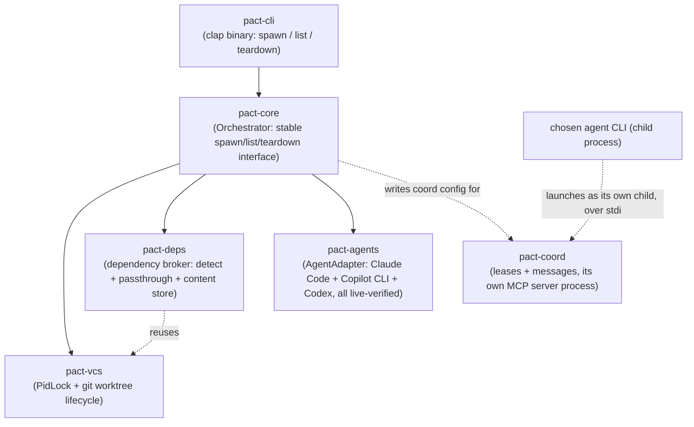
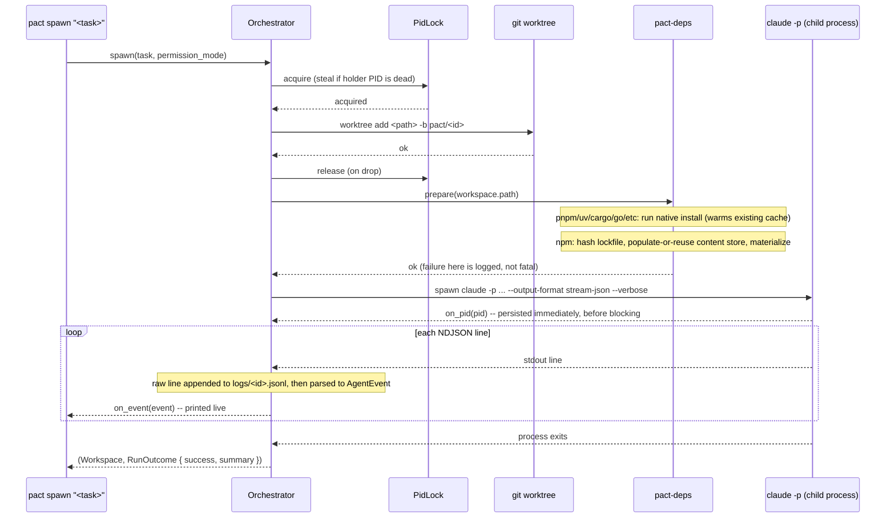
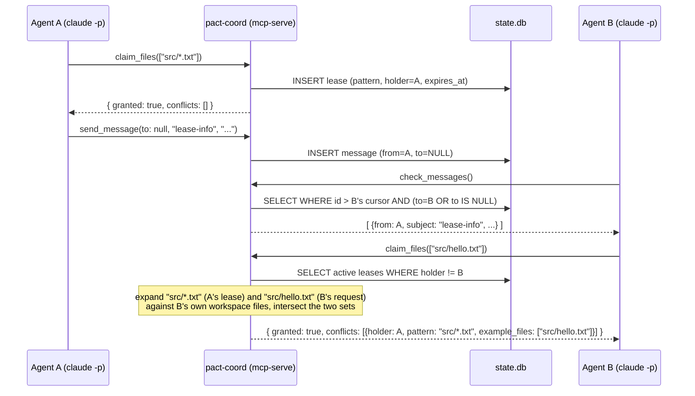

# pact

A language-agnostic orchestrator for running multiple AI coding agent CLIs
(Claude Code, GitHub Copilot CLI, Codex) in parallel on the same repository,
without them fighting each other.

## The problem

Running several coding agents at once on one repo hits three separate kinds
of pain, in this priority order:

1. **Dependency installs don't share.** Every `git worktree` starts with no
   `node_modules`/venv/etc., so each agent reinstalls from scratch.
2. **Agents can't tell each other anything.** There's no way for one agent
   to say "I just changed a function your task depends on" before the other
   finds out the hard way at merge time.
3. **Agents step on each other's files.** Two agents editing the same file
   in parallel is either avoided by manually partitioning work up front, or
   discovered as a merge conflict after the fact.

`git worktree` solves isolation but wasn't built for any of these three —
it was built for one human checking out a second branch, not an
orchestrator spinning up and tearing down N agent sandboxes per session.

## Design decisions

This section exists because the decisions below came from research and
back-and-forth discussion, not defaults — the reasoning is worth keeping
visible so it isn't silently re-litigated later.

### git worktree, not Jujutsu (jj)

Jujutsu's workspace model (`jj workspace add`) looks, on paper, like the
better fit: a lock-free operation log built for exactly this kind of
concurrent, multi-workspace use, plus first-class non-blocking conflicts.
It was seriously considered, including a real bug in Claude Code itself —
[anthropics/claude-code#34645](https://github.com/anthropics/claude-code/issues/34645)
— where concurrent `git worktree add` calls race on `.git/config.lock` and
fail, which is exactly the class of problem jj's operation log is designed
to avoid.

It was ruled out after a hands-on spike, not a documentation read:

- `jj git init --colocate` gives real git-command transparency, but only to
  the **one primary workspace**.
- `jj workspace add` — the feature that would let an orchestrator cheaply
  spin up N parallel agent workspaces — creates a directory with **no
  `.git` at all**. Confirmed directly: `git rev-parse --show-toplevel` run
  inside one silently climbed the directory tree and attached itself to an
  unrelated ancestor repository instead of erroring.
- The one documented workaround (a `.git` file with a `gitdir:` pointer)
  restores git *reads* only. Its own author's warning: git *writes* (add,
  commit, checkout, reset, stash) inside that workspace mutate the *main*
  repo's shared index/HEAD directly.

Since Claude Code, Copilot CLI, and Codex all write via native git
constantly — not occasionally — that's not an edge case, it's a
guaranteed collision, just moved one layer down and made silent instead of
loud. The bug that motivated considering jj is real, but the fix belongs in
the orchestrator's own locking (see `pact-vcs` below), not in swapping
the VCS.

### Rust

Matches the class of tool this is (uv, Codex CLI itself are both Rust):
precise control over hardlink/reflink/copy-fallback filesystem semantics,
a small static binary, and a concurrency model suited to supervising
several child processes at once.

### Dependency sharing leans on what already exists

Most package ecosystems already solved global dependency sharing — Cargo,
Go modules, Maven, Gradle, uv, pnpm, yarn, poetry, and pipenv all use a
global content-addressed or version-keyed cache by default. The gap is
narrower than "no ecosystem shares dependencies": it's specifically plain
npm (flat, per-project `node_modules`) and plain pip/venv. So
`pact-deps` (Phase 1) detects the package manager and passes through
to the ecosystem's own cache where one already exists well
(`passthrough.rs`), and only builds its own lockfile-hash-keyed content
store for the ecosystem that doesn't (`store.rs`, npm only).

Plain pip/venv was *also* a candidate for a custom store, and was
deliberately rejected, not deferred by accident: Python venvs aren't
reliably relocatable (activation scripts, `.pth` files, and console-script
shebangs can embed absolute paths tied to the original venv), so
hardlinking `site-packages` into a fresh venv is a correctness risk, not
just extra engineering — the same category of problem that justified
spiking jj before committing to it. Since pip already has its own global
download cache (`~/.cache/pip`) covering the expensive part (network
fetch), the remaining gap is bounded and left as future work.

**A sharper risk surfaced during an independent plan review before this
store was built, not after:** a plain *writable* hardlink means every
workspace's copy is the same underlying file record as the store entry —
so a package that writes into its own installed files post-install (a
native build step, a binary downloader, a git-hook installer) would
silently corrupt every other workspace, present and future, materialized
from that hash. `ContentStore::materialize` prefers reflink (copy-on-write,
safe under mutation by construction) and falls back to a hardlink marked
**read-only** at the destination, not a plain one — turning that failure
mode loud (the write fails) instead of silent (the store quietly rots).
One consequence worth knowing: because NTFS (and most filesystems) key
basic attributes to the underlying file record rather than the individual
link, marking a hardlink read-only also freezes the canonical store entry
itself after first use.

### Signaling scope for v1

Advisory, glob-based, TTL-expiring file leases plus a threaded message log
between agents — the same shape validated at real scale (40-50 concurrent
agents) by prior art ([MCP Agent Mail](https://mcpagentmail.com/)). Deep
semantic/AST-based "this changed a function signature used by X" analysis
is deliberately out of scope for v1: it's language-specific by nature,
which cuts against the language-agnostic goal, and it's a large amount of
scope for a v1. It's a plausible future direction once the basic lease/
message loop is proven, not a v1 requirement.

Leases are advisory by design, not enforced: `claim_files` is granted
regardless of conflicts it finds, same as prior art. What isn't a minor
detail is *how* overlap is detected -- two glob patterns can look nothing
alike as strings and still cover the same files (`src/**/*.rs` vs
`src/foo.rs`), so `pact-coord` expands both patterns against the
actual files in a workspace and intersects the resulting sets, rather than
comparing pattern strings. Verified against exactly that case, not just
identical patterns: one agent claimed `src/*.txt`, a second claimed the
narrower `src/hello.txt`, and the conflict was correctly detected and
reported with the specific overlapping file named.

The coordination database is deliberately *not* stored alongside
per-workspace bookkeeping in `.pact-<repo>/` (see State layout) --
that directory sits one level above every workspace
(`workspaces/<id>/../..`), and headless launches default to
`bypassPermissions`, so a careless broad shell command in any one agent's
workspace could otherwise reach and corrupt coordination state every other
agent depends on. It now lives under the platform's local data directory
instead, keyed by a hash of the repo root. Not a hard security boundary --
an agent's Bash tool can still reach an absolute path -- but it removes the
realistic risk of stumbling into it by accident via `../..`. Found by
independent plan review before this was built, not after.

`rmcp` (the official Rust MCP SDK) requires an async runtime. Rather than
making the whole CLI async for this one server, it runs as its own OS
process (`pact mcp-serve`, launched by the agent CLI itself over
stdio, not run in-process by the orchestrator), and that subcommand builds
its own `tokio::Runtime` just for its own lifetime -- `spawn`/`list`/
`teardown` stay exactly as synchronous as before. Same reasoning as the
process-supervision decision below.

### The orchestrator must own workspace creation

A consequence discovered during the jj spike, not an arbitrary choice: this
tool has to create each workspace and launch **one agent process into it
itself**. It can't lean on an agent CLI's own built-in parallelism (Copilot
CLI's `/fleet`, Claude Code's Task-tool subagents-with-worktrees), because
that would mean two independent orchestration layers fighting over the
same repository.

### Process supervision stays synchronous for now

Everything in the codebase is blocking `std::process::Command`, including
Phase 2's agent launch -- `tokio` was declared as a workspace dependency
from the initial scaffold but is still unused. Introducing it just for one
adapter would mean either a half-async codebase or forcing every existing
blocking call through `spawn_blocking` for no present benefit, since only
one child process runs per `spawn` today. The seam that will matter is
structural, not sync-vs-async: process supervision lives entirely behind
`pact_agents::run_and_stream`, so whichever phase first needs to
supervise several *running* agents concurrently can change what's behind
that boundary without touching adapters or the orchestrator's call site.

### Headless safety defaults differ by adapter -- verified, not assumed

There's no TTY in headless mode to answer an interactive permission
prompt, so *some* unattended-safety setting is mandatory for every agent
CLI. What that setting should default to was investigated empirically
(issue #2), not assumed from docs, and the answer turned out to be
genuinely different per adapter:

- **Claude Code has a real, safer, non-hanging default.** Confirmed
  directly: an explicit `--allowedTools` list (covering file
  read/write/edit/search plus the VCS and package-manager commands
  `pact-deps` already knows how to prepare -- `git`, `npm`, `pnpm`,
  `yarn`, `cargo`, `go`, `pip`, `uv`, `mvn`, `gradle`), combined with
  Claude Code's own baseline permission mode (not `bypassPermissions`),
  makes an out-of-scope tool call get **denied cleanly and immediately**
  rather than hang -- the agent adapts and keeps working with whatever it
  *is* allowed to do. This is `pact`'s default for Claude Code now.
  Earlier documentation here claimed no mode short of `bypassPermissions`
  could avoid hanging; that was right about permission-mode alone, but
  incomplete -- it's specifically an explicit tool allowlist that unlocks
  safe non-interactive denial, independent of which permission mode is
  active.
- **Copilot CLI and Codex don't have a confirmed safe-and-functional
  alternative, so they keep their bypass-flag defaults.** Copilot CLI's
  `--allow-tool` works for in-scope actions, but confirmed directly: a
  task needing a tool outside that list **hangs** (not a clean deny) --
  its non-interactive mode doesn't have the same auto-deny fallback
  Claude Code's does. Codex's `--sandbox workspace-write` alone doesn't
  hang, but it also can't write files at all in headless mode, which
  defeats the point of running it. Shipping either as a "safer default"
  without that being true would repeat exactly the mistake found and
  fixed in the Codex adapter (documentation presented as fact, unverified)
  -- so both keep `--allow-all-tools` /
  `--dangerously-bypass-approvals-and-sandbox` for now, stated plainly as
  a real, asymmetric gap rather than smoothed over.

Every launch prints a warning naming exactly what the adapter's active
setting permits (not just which flag string is in effect), and `--safety`
is an explicit, overridable flag either way -- see "What can an agent
actually do to my machine?" below.

### What can an agent actually do to my machine?

- **Claude Code (default)**: read/write/edit files anywhere in its
  workspace, and run `git`/`npm`/`pnpm`/`yarn`/`cargo`/`go`/`pip`/`uv`/
  `mvn`/`gradle` commands. Anything else (an arbitrary shell command, a
  tool outside that list) is denied automatically -- the agent will work
  around the denial rather than stall.
- **Copilot CLI (default) and Codex (default)**: can run *any* shell
  command and edit *any* file the OS-level user running `pact` can reach,
  with no restriction. This is not a hardening choice -- it's the only
  configuration either adapter has been confirmed to actually get work
  done with in headless mode. Treat a Copilot CLI or Codex workspace with
  the same trust you'd give a script you ran with your own full user
  permissions, because that's effectively what it has.
- All three: `--safety <value>` overrides the default in that adapter's
  own vocabulary (Claude Code's `--permission-mode` values, Codex's
  `--sandbox` values; Copilot CLI has no gradient to override).

### One AgentAdapter trait, not one unified safety enum

Phases 0-3 built exactly one adapter (Claude Code) without the
abstraction; `AgentAdapter` (Phase 4) was introduced once a second and
third real case existed to generalize against, not designed speculatively
in advance. The trait deliberately does *not* try to unify each CLI's
safety/approval vocabulary into one shared enum: Claude Code's
`--permission-mode` has six values, Copilot CLI's is a binary on/off with
no gradient at all, and Codex's real, confirmed shape turned out to be one
all-or-nothing flag (`--dangerously-bypass-approvals-and-sandbox`) rather
than the two independent `--sandbox`/`--ask-for-approval` axes OpenAI's
docs implied -- `--ask-for-approval` doesn't exist in the installed
version's `codex exec --help` at all. `build_command` takes a raw string
passed straight through to whichever vocabulary the chosen adapter uses,
rather than a shared type that would either lose expressiveness or need
constant extending as a fourth CLI's vocabulary inevitably differs again.

What *is* shared is `CoordConfig` -- what to tell an agent CLI about the
coordination server (name/command/args) is adapter-agnostic, even though
*how* to hand it over isn't: Claude Code and Copilot CLI both confirmed
the identical `{"mcpServers": {...}}` JSON-file-plus-flag shape, while
Codex takes inline `-c mcp_servers.<id>.*` config overrides instead and
needs no file at all -- confirmed working end-to-end, including a real
`claim_files` call through this project's own coordination server.

Codex's adapter was initially built from OpenAI's documentation alone (the
machine this project was first built on didn't have `codex` installed),
and was upgraded to live-verified once it was actually installed and run:
the documented `--ask-for-approval` flag turned out not to exist, and had
to be replaced with the confirmed-working bypass flag above. That's the
concrete reason this project treats "docs-only" and "live-verified" as
genuinely different claims, not a formality -- the docs were wrong on the
one flag that mattered most. One risk avoided along the way regardless:
Codex's normal MCP config mechanism is a `$CODEX_HOME/config.toml` file,
but `CODEX_HOME` also relocates auth/session state, not just config --
pointing it at a per-workspace directory would plausibly break headless
login on first use. The inline `-c` override sidesteps that entirely, and
was confirmed to actually connect to and call a real MCP server.

## Architecture



`pact-deps` reuses `pact-vcs`'s `PidLock` directly (generalized
from its original git-specific name) to guard concurrent population of a
store entry, the same protection Phase 0 built for `git worktree`
operations. `pact-coord` is not called in-process by `pact-core`
at all -- the orchestrator only writes the config file that tells the
agent CLI to launch it itself, over stdio, as its own separate process.

### Spawn / teardown flow



The git lock exists because git itself races on `.git/config.lock` when
`git worktree add`/`remove` run concurrently
([anthropics/claude-code#34645](https://github.com/anthropics/claude-code/issues/34645)) --
`pact-vcs` serializes what git doesn't safely parallelize on its own,
and steals locks left behind by a process that died without cleaning up
(checked via PID liveness, not a timeout guess). The same `PidLock` guards
content-store population in `pact-deps`, so two concurrent spawns
targeting the same lockfile hash don't race each other.

`teardown` kills a workspace's live agent process (whole tree, not just the
tracked PID -- see Status) before removing its worktree, in case it's
invoked from a different `pact` call than the one blocked on `spawn`. It
also force-deletes the workspace's `pact/<id>` branch by default (`git
worktree remove` doesn't delete the branch it was created with -- worktree
removal and branch deletion are independent in git) -- pass `--keep-branch`
to keep it around for inspection or rebasing.

### Cross-agent coordination flow



Each agent is a separate `claude -p` process that launches its own
`pact mcp-serve` as an MCP server over stdio (per its generated
config); they're not talking to each other directly, or to a shared
in-process daemon -- `state.db` (SQLite, WAL mode) is the only thing
actually shared between them.

### State layout

All state lives as a **sibling** of the repo, not inside its working tree,
so it never shows up in the main repo's `git status`:

```
<repo-parent>/.pact-<repo-name>/
├── locks/git.lock              # PID-aware lock serializing worktree add/remove
├── meta/<id>.json               # id, path, branch, task, created_at, agent_pid
├── mcp/<id>.json                 # generated --mcp-config file for this workspace
├── workspaces/<id>/            # the actual git worktree for that agent
├── logs/<id>.jsonl              # raw NDJSON, one line per agent stdout line, as-is
└── store/npm/<platform>-<hash>/   # populated once per (platform, lockfile) pair,
    ├── ...                         # materialized (reflink/read-only-hardlink/copy)
    └── <hash>.lock                 # into every workspace whose lockfile matches
```

The coordination database is the one exception -- deliberately *not* here
(see Design decisions for why):

```
<platform-local-data-dir>/pact/<sha256(repo_root)[..16]>/state.db
```

e.g. `%LOCALAPPDATA%\pact\<hash>\state.db` on Windows,
`~/.local/share/pact/<hash>/state.db` on Linux.

## Status

| Phase | What | Status |
|---|---|---|
| 0 | Workspace lifecycle + the concurrency fix | **Done** |
| 1 | Dependency broker (shared installs) | **Done** |
| 2 | Claude Code adapter, real headless launch | **Done** |
| 3 | Coordination MCP server (leases + messages) | **Done** |
| 4 | Copilot CLI + Codex adapters (both live-verified); `--agent`/`--safety` CLI flags | **Done** |

Phase 0 was verified against a real repository: 6 concurrent `spawn` calls
all succeeded (reproducing, then passing, the exact scenario that fails in
claude-code#34645), `git worktree list` matched pact's own state
exactly, and `teardown` removed a worktree cleanly with no orphaned
metadata.

Phase 1 was verified against a real npm project (a `package.json` depending
on a small real package): a cold `spawn` ran a real `npm ci` into the
content store (~9s); a second `spawn` materialized instead of reinstalling
(~0.5s); `node_modules` resolved correctly (`require` worked) in both; and
two concurrent spawns racing the *same* lockfile hash both succeeded with
a single, correctly-populated store entry — no corruption, no partial
state. One real bug found and fixed along the way: on Windows,
`std::process::Command` doesn't resolve `npm`/`pnpm`/`yarn`'s `.cmd` shims
the way a shell does (no `PATHEXT` lookup), so every passthrough call was
silently failing with "program not found" until routed through `cmd /C`.

Phase 2 was verified against a real headless launch: a task requiring an
actual tool call (write a file with specific content), not a trivial
text-only one, per review feedback that a no-tool-use test wouldn't
exercise the important path. Confirmed: the `tool_use` event carried the
correct file path scoped inside the workspace, the file's contents were
exactly right, the raw NDJSON log matched what streamed to the terminal,
and the tool-result echo event (a `"user"`-typed message, previously
unobserved) came through as `[other]` rather than being silently dropped.

The teardown-while-running path surfaced two real, previously unknown
Windows bugs, only found by actually killing a genuinely running agent
mid-task rather than assuming the happy path: (1) killing a process
doesn't release its handles on its own working directory instantly, so an
immediate `git worktree remove` raced that cleanup and failed; (2) git
unregisters a worktree from its metadata *before* deleting the directory,
so once (1) failed once, retrying `git worktree remove` failed differently
("is not a working tree") while the directory sat there orphaned; (3)
killing only the tracked PID wasn't enough at all -- a Bash tool call spawns
a child shell process, and killing just the parent left that child alive,
still holding the directory open for the rest of its natural life. Fixed
with a retry-then-fall-back-to-direct-removal path for (1)/(2), and
`taskkill /F /T /PID` (kills the whole descendant tree) for (3). See the
`pact-vcs` commit history for the full writeup.

Phase 3 was verified with two real, concurrent Claude Code sessions in the
same repo, not a mocked or single-agent test: agent A claimed `src/*.txt`
and broadcast a message; agent B retrieved that message via
`check_messages` (confirmed byte-for-byte correct on disk), then claimed
the narrower, differently-worded `src/hello.txt` and received back the
correct conflict -- agent A's holder id, its actual pattern, and the
specific overlapping file -- proving the glob-expansion overlap detection
works against genuinely different pattern strings, not just identical
ones. The coordination database was confirmed to land in the relocated
platform data directory, not the repo-adjacent state tree.

Phase 4 added Copilot CLI, live-verified to the same standard: launch
flags and MCP config shape confirmed against real invocations, and the
event schema confirmed by deliberately forcing a tool-call-producing task
to capture `toolRequests`' real field names rather than guessing (they
turned out to differ from Claude Code's: `name`/`arguments`, not
`name`/`input`). A real coordination run against Copilot CLI worked
end-to-end: `claim_files` called through the generated MCP config,
`pact-coord` reported `connected`, and the exact JSON result written
back to disk correctly. One more real bug found in the process, the same
class as Phase 1's: Copilot CLI is *also* a Windows `.cmd` shim, and
`pact-agents`' own process spawning had never gotten the `cmd /C`
fix Phase 1 applied elsewhere in the codebase -- every Copilot launch was
silently failing with "program not found" until fixed. The Codex adapter
was initially implemented from documentation only (`codex` wasn't
installed on this machine at the time) and was later upgraded to
live-verified once it was actually installed and run: the documented
`--ask-for-approval` flag doesn't exist in the real CLI, real end-to-end
behavior (including a genuine `claim_files` MCP call through this
project's own coordination server, returning the correct JSON) required
`--dangerously-bypass-approvals-and-sandbox` instead, and a related bug
was found and fixed along the way -- `process::run_and_stream`'s fallback
outcome hardcoded `success: false` whenever an adapter didn't emit an
explicit Result-shaped event, which silently mislabeled every successful
Codex run as failed (Codex's `turn.completed` event, confirmed directly,
carries no success/failure signal at all). Fixed to use the process's
actual exit code instead. All three adapters (Claude Code, Copilot CLI,
Codex) are now live-verified to the same standard.

## Known limitations
- **Process-tree killing on teardown is Windows-only** (`taskkill /F /T`).
  The Unix equivalent (a process group established via `setsid` at spawn
  time) isn't implemented -- this project was built and verified entirely
  on Windows.
- **CI covers cross-platform build + test, not live-agent verification.**
  Every Phase 0-4 scenario in this README was verified by actually running
  real agent CLIs on Windows -- CI (GitHub Actions, all three platforms)
  catches compile/test regressions on macOS/Linux, but re-running those
  same live scenarios there needs a human, or a cloud agent, with actual
  access -- neither of which this project has had yet.
- **No custom dependency-sharing store for plain pip/venv** -- deliberately
  out of scope (see Design decisions), not an oversight.
- **Ctrl-C handling is single-shot per process** (see
  `pact_agents::run_and_stream`'s doc comment) -- fine for today's
  one-agent-per-`spawn` architecture, would need a different design for a
  future phase supervising several agents concurrently in one process.

## Usage

```sh
cargo build

# from inside (or pass --repo to) a git repository:
pact spawn "implement the thing"
pact spawn "implement the thing" --agent copilot
pact spawn "implement the thing" --agent claude --safety acceptEdits
pact list
pact teardown <id>
pact teardown <id> --keep-branch  # skip deleting the workspace's branch
```

`spawn` creates the worktree, best-effort prepares dependencies for every
package manager it detects (pass-through install for ecosystems with their
own cache, content-store materialization for npm), then launches the
chosen agent CLI (`--agent claude` by default) headlessly -- with a
generated coordination config giving it `claim_files`/`release_files`/
`send_message`/`check_messages` tools automatically, no extra setup
needed -- and blocks until it finishes, streaming `[init]`/`[coord]`/
`[assistant]`/`[tool]`/`[other]` lines live and printing a final
done/failed summary. A dependency-prepare failure is logged as a warning,
not fatal; so is a coordination server that fails to connect (checked
against the live event stream, not assumed). `--safety` overrides
whichever adapter's own unattended-safety default is otherwise used (a
warning is printed either way) -- see Design decisions for why headless
mode requires *some* such setting for every adapter, not just Claude
Code, and why their vocabularies aren't unified into one shared flag.
