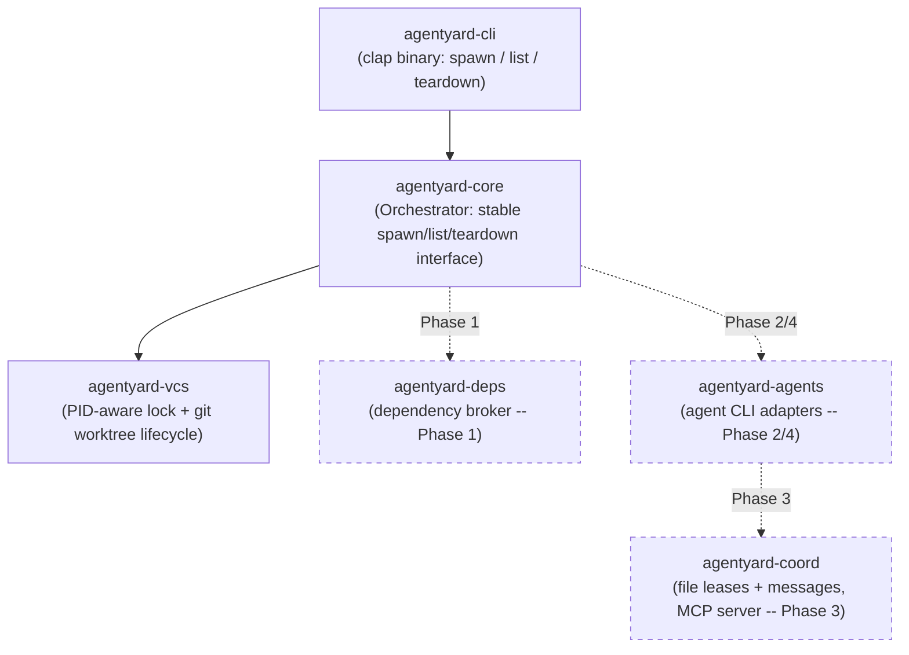
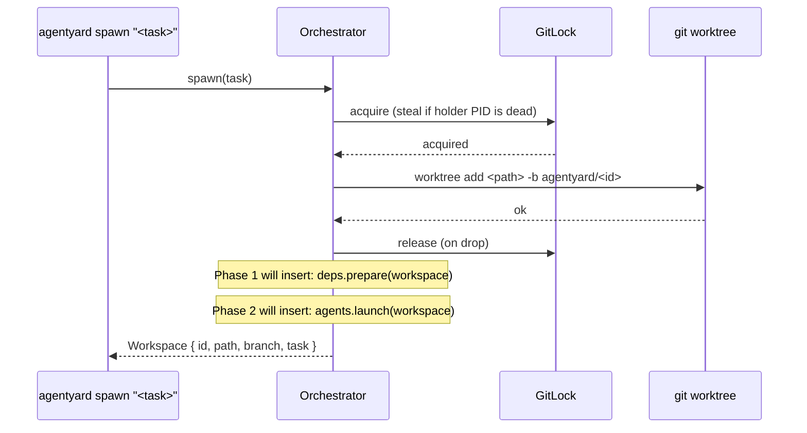

# agentyard

A language-agnostic orchestrator for running multiple AI coding agent CLIs
(Claude Code, GitHub Copilot CLI, Codex) in parallel on the same repository,
without them fighting each other.

## The problem

Running several coding agents at once on one repo hits three separate kinds
of pain, in this priority order:

1. **Dependency installs don't share.** Every `git worktree` starts with no
   `node_modules`/venv/etc., so each agent reinstalls from scratch.
2. **Agents can't tell each other anything.** There's no way for one agent
   to say "I just changed a function your task depends on" before the other
   finds out the hard way at merge time.
3. **Agents step on each other's files.** Two agents editing the same file
   in parallel is either avoided by manually partitioning work up front, or
   discovered as a merge conflict after the fact.

`git worktree` solves isolation but wasn't built for any of these three —
it was built for one human checking out a second branch, not an
orchestrator spinning up and tearing down N agent sandboxes per session.

## Design decisions

This section exists because the decisions below came from research and
back-and-forth discussion, not defaults — the reasoning is worth keeping
visible so it isn't silently re-litigated later.

### git worktree, not Jujutsu (jj)

Jujutsu's workspace model (`jj workspace add`) looks, on paper, like the
better fit: a lock-free operation log built for exactly this kind of
concurrent, multi-workspace use, plus first-class non-blocking conflicts.
It was seriously considered, including a real bug in Claude Code itself —
[anthropics/claude-code#34645](https://github.com/anthropics/claude-code/issues/34645)
— where concurrent `git worktree add` calls race on `.git/config.lock` and
fail, which is exactly the class of problem jj's operation log is designed
to avoid.

It was ruled out after a hands-on spike, not a documentation read:

- `jj git init --colocate` gives real git-command transparency, but only to
  the **one primary workspace**.
- `jj workspace add` — the feature that would let an orchestrator cheaply
  spin up N parallel agent workspaces — creates a directory with **no
  `.git` at all**. Confirmed directly: `git rev-parse --show-toplevel` run
  inside one silently climbed the directory tree and attached itself to an
  unrelated ancestor repository instead of erroring.
- The one documented workaround (a `.git` file with a `gitdir:` pointer)
  restores git *reads* only. Its own author's warning: git *writes* (add,
  commit, checkout, reset, stash) inside that workspace mutate the *main*
  repo's shared index/HEAD directly.

Since Claude Code, Copilot CLI, and Codex all write via native git
constantly — not occasionally — that's not an edge case, it's a
guaranteed collision, just moved one layer down and made silent instead of
loud. The bug that motivated considering jj is real, but the fix belongs in
the orchestrator's own locking (see `agentyard-vcs` below), not in swapping
the VCS.

### Rust

Matches the class of tool this is (uv, Codex CLI itself are both Rust):
precise control over hardlink/reflink/copy-fallback filesystem semantics,
a small static binary, and a concurrency model suited to supervising
several child processes at once.

### Dependency sharing leans on what already exists

Most package ecosystems already solved global dependency sharing — Cargo,
Go modules, Maven, uv, and pnpm all use a global content-addressed or
version-keyed cache by default. The gap is narrower than "no ecosystem
shares dependencies": it's specifically plain npm (flat, per-project
`node_modules`) and plain pip/venv. So `agentyard-deps` (Phase 1) detects
the package manager and passes through to the ecosystem's own cache where
one already exists well, and only builds its own lockfile-hash-keyed,
hardlink-with-copy-fallback store for the ecosystems that don't.

### Signaling scope for v1

Advisory, glob-based, TTL-expiring file leases plus a threaded message log
between agents — the same shape validated at real scale (40-50 concurrent
agents) by prior art ([MCP Agent Mail](https://mcpagentmail.com/)). Deep
semantic/AST-based "this changed a function signature used by X" analysis
is deliberately out of scope for v1: it's language-specific by nature,
which cuts against the language-agnostic goal, and it's a large amount of
scope for a v1. It's a plausible future direction once the basic lease/
message loop is proven, not a v1 requirement.

### The orchestrator must own workspace creation

A consequence discovered during the jj spike, not an arbitrary choice: this
tool has to create each workspace and launch **one agent process into it
itself**. It can't lean on an agent CLI's own built-in parallelism (Copilot
CLI's `/fleet`, Claude Code's Task-tool subagents-with-worktrees), because
that would mean two independent orchestration layers fighting over the
same repository.

## Architecture



Dashed boxes are stubbed today (a doc comment describing their future
role) but not yet implemented — see Status below.

### Spawn / teardown flow



The lock exists because git itself races on `.git/config.lock` when
`git worktree add`/`remove` run concurrently
([anthropics/claude-code#34645](https://github.com/anthropics/claude-code/issues/34645)) --
`agentyard-vcs` serializes what git doesn't safely parallelize on its own,
and steals locks left behind by a process that died without cleaning up
(checked via PID liveness, not a timeout guess).

### State layout

All state lives as a **sibling** of the repo, not inside its working tree,
so it never shows up in the main repo's `git status`:

```
<repo-parent>/.agentyard-<repo-name>/
├── locks/git.lock       # PID-aware lock serializing worktree add/remove
├── meta/<id>.json       # one file per workspace: id, path, branch, task, created_at
└── workspaces/<id>/     # the actual git worktree for that agent
```

## Status

| Phase | What | Status |
|---|---|---|
| 0 | Workspace lifecycle + the concurrency fix | **Done** |
| 1 | Dependency broker (shared installs) | Planned |
| 2 | Claude Code adapter, real headless launch | Planned |
| 3 | Coordination MCP server (leases + messages) | Planned |
| 4 | Codex + Copilot CLI adapters, polish | Planned |

Phase 0 was verified against a real repository: 6 concurrent `spawn` calls
all succeeded (reproducing, then passing, the exact scenario that fails in
claude-code#34645), `git worktree list` matched agentyard's own state
exactly, and `teardown` removed a worktree cleanly with no orphaned
metadata.

## Usage (Phase 0)

```sh
cargo build

# from inside (or pass --repo to) a git repository:
agentyard spawn "implement the thing"
agentyard list
agentyard teardown <id>
```
