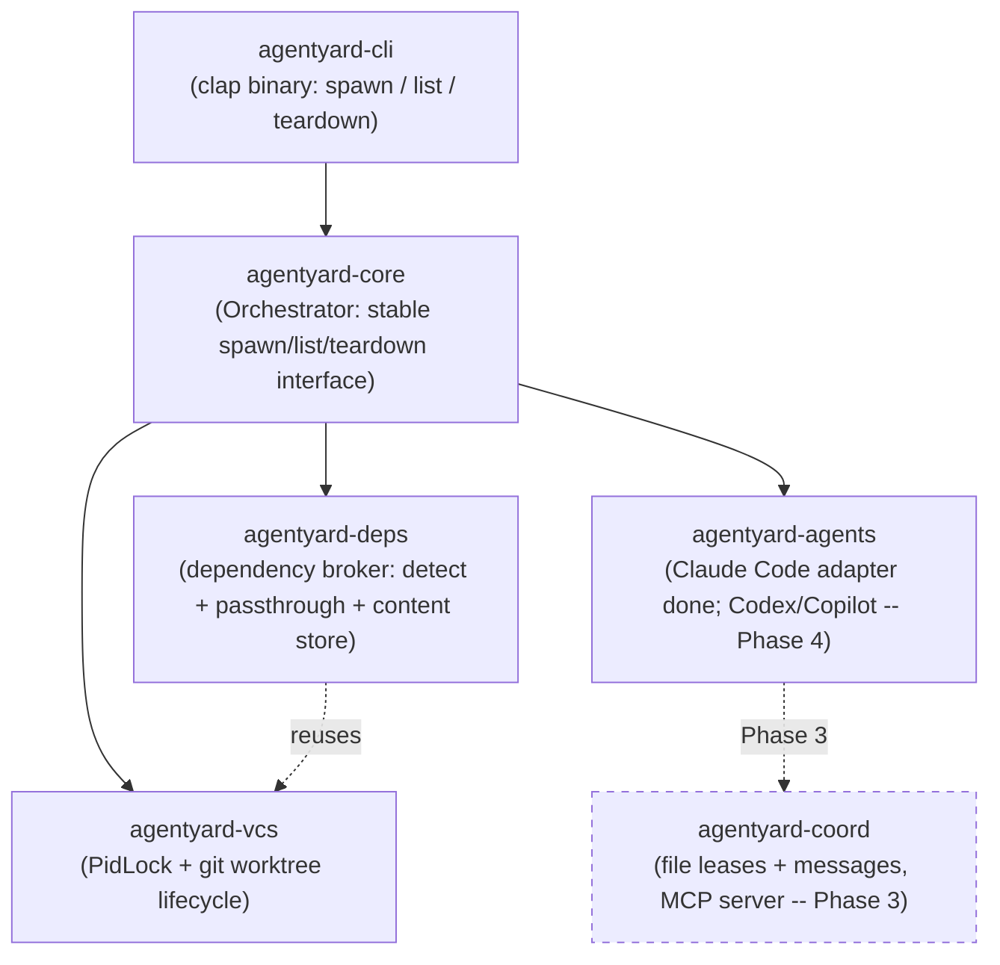
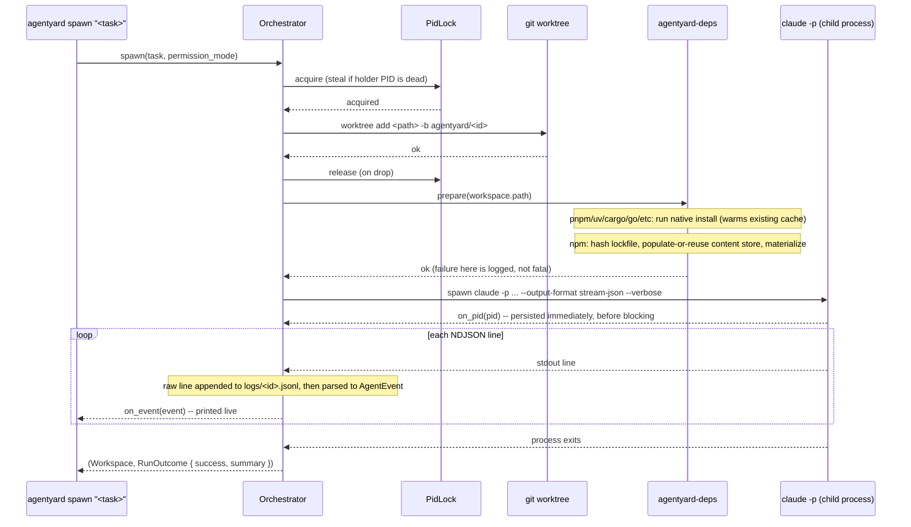

# agentyard

A language-agnostic orchestrator for running multiple AI coding agent CLIs
(Claude Code, GitHub Copilot CLI, Codex) in parallel on the same repository,
without them fighting each other.

## The problem

Running several coding agents at once on one repo hits three separate kinds
of pain, in this priority order:

1. **Dependency installs don't share.** Every `git worktree` starts with no
   `node_modules`/venv/etc., so each agent reinstalls from scratch.
2. **Agents can't tell each other anything.** There's no way for one agent
   to say "I just changed a function your task depends on" before the other
   finds out the hard way at merge time.
3. **Agents step on each other's files.** Two agents editing the same file
   in parallel is either avoided by manually partitioning work up front, or
   discovered as a merge conflict after the fact.

`git worktree` solves isolation but wasn't built for any of these three —
it was built for one human checking out a second branch, not an
orchestrator spinning up and tearing down N agent sandboxes per session.

## Design decisions

This section exists because the decisions below came from research and
back-and-forth discussion, not defaults — the reasoning is worth keeping
visible so it isn't silently re-litigated later.

### git worktree, not Jujutsu (jj)

Jujutsu's workspace model (`jj workspace add`) looks, on paper, like the
better fit: a lock-free operation log built for exactly this kind of
concurrent, multi-workspace use, plus first-class non-blocking conflicts.
It was seriously considered, including a real bug in Claude Code itself —
[anthropics/claude-code#34645](https://github.com/anthropics/claude-code/issues/34645)
— where concurrent `git worktree add` calls race on `.git/config.lock` and
fail, which is exactly the class of problem jj's operation log is designed
to avoid.

It was ruled out after a hands-on spike, not a documentation read:

- `jj git init --colocate` gives real git-command transparency, but only to
  the **one primary workspace**.
- `jj workspace add` — the feature that would let an orchestrator cheaply
  spin up N parallel agent workspaces — creates a directory with **no
  `.git` at all**. Confirmed directly: `git rev-parse --show-toplevel` run
  inside one silently climbed the directory tree and attached itself to an
  unrelated ancestor repository instead of erroring.
- The one documented workaround (a `.git` file with a `gitdir:` pointer)
  restores git *reads* only. Its own author's warning: git *writes* (add,
  commit, checkout, reset, stash) inside that workspace mutate the *main*
  repo's shared index/HEAD directly.

Since Claude Code, Copilot CLI, and Codex all write via native git
constantly — not occasionally — that's not an edge case, it's a
guaranteed collision, just moved one layer down and made silent instead of
loud. The bug that motivated considering jj is real, but the fix belongs in
the orchestrator's own locking (see `agentyard-vcs` below), not in swapping
the VCS.

### Rust

Matches the class of tool this is (uv, Codex CLI itself are both Rust):
precise control over hardlink/reflink/copy-fallback filesystem semantics,
a small static binary, and a concurrency model suited to supervising
several child processes at once.

### Dependency sharing leans on what already exists

Most package ecosystems already solved global dependency sharing — Cargo,
Go modules, Maven, Gradle, uv, pnpm, yarn, poetry, and pipenv all use a
global content-addressed or version-keyed cache by default. The gap is
narrower than "no ecosystem shares dependencies": it's specifically plain
npm (flat, per-project `node_modules`) and plain pip/venv. So
`agentyard-deps` (Phase 1) detects the package manager and passes through
to the ecosystem's own cache where one already exists well
(`passthrough.rs`), and only builds its own lockfile-hash-keyed content
store for the ecosystem that doesn't (`store.rs`, npm only).

Plain pip/venv was *also* a candidate for a custom store, and was
deliberately rejected, not deferred by accident: Python venvs aren't
reliably relocatable (activation scripts, `.pth` files, and console-script
shebangs can embed absolute paths tied to the original venv), so
hardlinking `site-packages` into a fresh venv is a correctness risk, not
just extra engineering — the same category of problem that justified
spiking jj before committing to it. Since pip already has its own global
download cache (`~/.cache/pip`) covering the expensive part (network
fetch), the remaining gap is bounded and left as future work.

**A sharper risk surfaced during an independent plan review before this
store was built, not after:** a plain *writable* hardlink means every
workspace's copy is the same underlying file record as the store entry —
so a package that writes into its own installed files post-install (a
native build step, a binary downloader, a git-hook installer) would
silently corrupt every other workspace, present and future, materialized
from that hash. `ContentStore::materialize` prefers reflink (copy-on-write,
safe under mutation by construction) and falls back to a hardlink marked
**read-only** at the destination, not a plain one — turning that failure
mode loud (the write fails) instead of silent (the store quietly rots).
One consequence worth knowing: because NTFS (and most filesystems) key
basic attributes to the underlying file record rather than the individual
link, marking a hardlink read-only also freezes the canonical store entry
itself after first use.

### Signaling scope for v1

Advisory, glob-based, TTL-expiring file leases plus a threaded message log
between agents — the same shape validated at real scale (40-50 concurrent
agents) by prior art ([MCP Agent Mail](https://mcpagentmail.com/)). Deep
semantic/AST-based "this changed a function signature used by X" analysis
is deliberately out of scope for v1: it's language-specific by nature,
which cuts against the language-agnostic goal, and it's a large amount of
scope for a v1. It's a plausible future direction once the basic lease/
message loop is proven, not a v1 requirement.

### The orchestrator must own workspace creation

A consequence discovered during the jj spike, not an arbitrary choice: this
tool has to create each workspace and launch **one agent process into it
itself**. It can't lean on an agent CLI's own built-in parallelism (Copilot
CLI's `/fleet`, Claude Code's Task-tool subagents-with-worktrees), because
that would mean two independent orchestration layers fighting over the
same repository.

### Process supervision stays synchronous for now

Everything in the codebase is blocking `std::process::Command`, including
Phase 2's agent launch -- `tokio` was declared as a workspace dependency
from the initial scaffold but is still unused. Introducing it just for one
adapter would mean either a half-async codebase or forcing every existing
blocking call through `spawn_blocking` for no present benefit, since only
one child process runs per `spawn` today. The seam that will matter is
structural, not sync-vs-async: process supervision lives entirely behind
`agentyard_agents::run_and_stream`, so whichever phase first needs to
supervise several *running* agents concurrently can change what's behind
that boundary without touching adapters or the orchestrator's call site.

### Headless launch requires bypassing permissions, not a hardening choice

There's no TTY in `-p`/headless mode to answer an interactive permission
prompt, so *some* non-interactive permission mode is mandatory to avoid
hanging forever the first time a session hits a permission-gated action --
of Claude Code's six modes, `bypassPermissions` is the only one that
can't still hang, since e.g. `acceptEdits` only auto-accepts file edits and
would still gate an arbitrary Bash call. This is surfaced loudly (a
warning printed before every launch that uses the default) rather than
silently baked in, and is an explicit, overridable `--permission-mode` flag
precisely because it means an unattended agent bypasses every check with
no human in the loop.

## Architecture



The dashed box is stubbed today (a doc comment describing its future
role) but not yet implemented — see Status below. `agentyard-deps` reuses
`agentyard-vcs`'s `PidLock` directly (generalized from its original
git-specific name) to guard concurrent population of a store entry, the
same protection Phase 0 built for `git worktree` operations.

### Spawn / teardown flow



The git lock exists because git itself races on `.git/config.lock` when
`git worktree add`/`remove` run concurrently
([anthropics/claude-code#34645](https://github.com/anthropics/claude-code/issues/34645)) --
`agentyard-vcs` serializes what git doesn't safely parallelize on its own,
and steals locks left behind by a process that died without cleaning up
(checked via PID liveness, not a timeout guess). The same `PidLock` guards
content-store population in `agentyard-deps`, so two concurrent spawns
targeting the same lockfile hash don't race each other.

`teardown` kills a workspace's live agent process (whole tree, not just the
tracked PID -- see Status) before removing its worktree, in case it's
invoked from a different `agentyard` call than the one blocked on `spawn`.

### State layout

All state lives as a **sibling** of the repo, not inside its working tree,
so it never shows up in the main repo's `git status`:

```
<repo-parent>/.agentyard-<repo-name>/
├── locks/git.lock              # PID-aware lock serializing worktree add/remove
├── meta/<id>.json               # id, path, branch, task, created_at, agent_pid
├── workspaces/<id>/            # the actual git worktree for that agent
├── logs/<id>.jsonl              # raw NDJSON, one line per agent stdout line, as-is
└── store/npm/<platform>-<hash>/   # populated once per (platform, lockfile) pair,
    ├── ...                         # materialized (reflink/read-only-hardlink/copy)
    └── <hash>.lock                 # into every workspace whose lockfile matches
```

## Status

| Phase | What | Status |
|---|---|---|
| 0 | Workspace lifecycle + the concurrency fix | **Done** |
| 1 | Dependency broker (shared installs) | **Done** |
| 2 | Claude Code adapter, real headless launch | **Done** |
| 3 | Coordination MCP server (leases + messages) | Planned |
| 4 | Codex + Copilot CLI adapters, polish | Planned |

Phase 0 was verified against a real repository: 6 concurrent `spawn` calls
all succeeded (reproducing, then passing, the exact scenario that fails in
claude-code#34645), `git worktree list` matched agentyard's own state
exactly, and `teardown` removed a worktree cleanly with no orphaned
metadata.

Phase 1 was verified against a real npm project (a `package.json` depending
on a small real package): a cold `spawn` ran a real `npm ci` into the
content store (~9s); a second `spawn` materialized instead of reinstalling
(~0.5s); `node_modules` resolved correctly (`require` worked) in both; and
two concurrent spawns racing the *same* lockfile hash both succeeded with
a single, correctly-populated store entry — no corruption, no partial
state. One real bug found and fixed along the way: on Windows,
`std::process::Command` doesn't resolve `npm`/`pnpm`/`yarn`'s `.cmd` shims
the way a shell does (no `PATHEXT` lookup), so every passthrough call was
silently failing with "program not found" until routed through `cmd /C`.

Phase 2 was verified against a real headless launch: a task requiring an
actual tool call (write a file with specific content), not a trivial
text-only one, per review feedback that a no-tool-use test wouldn't
exercise the important path. Confirmed: the `tool_use` event carried the
correct file path scoped inside the workspace, the file's contents were
exactly right, the raw NDJSON log matched what streamed to the terminal,
and the tool-result echo event (a `"user"`-typed message, previously
unobserved) came through as `[other]` rather than being silently dropped.

The teardown-while-running path surfaced two real, previously unknown
Windows bugs, only found by actually killing a genuinely running agent
mid-task rather than assuming the happy path: (1) killing a process
doesn't release its handles on its own working directory instantly, so an
immediate `git worktree remove` raced that cleanup and failed; (2) git
unregisters a worktree from its metadata *before* deleting the directory,
so once (1) failed once, retrying `git worktree remove` failed differently
("is not a working tree") while the directory sat there orphaned; (3)
killing only the tracked PID wasn't enough at all -- a Bash tool call spawns
a child shell process, and killing just the parent left that child alive,
still holding the directory open for the rest of its natural life. Fixed
with a retry-then-fall-back-to-direct-removal path for (1)/(2), and
`taskkill /F /T /PID` (kills the whole descendant tree) for (3). See the
`agentyard-vcs` commit history for the full writeup.

## Usage

```sh
cargo build

# from inside (or pass --repo to) a git repository:
agentyard spawn "implement the thing"
agentyard spawn "implement the thing" --permission-mode acceptEdits
agentyard list
agentyard teardown <id>
```

`spawn` creates the worktree, best-effort prepares dependencies for every
package manager it detects (pass-through install for ecosystems with their
own cache, content-store materialization for npm), then launches Claude
Code headlessly and blocks until it finishes, streaming `[init]`/
`[assistant]`/`[tool]`/`[other]` lines live and printing a final done/failed
summary. A dependency-prepare failure is logged as a warning, not fatal.
`--permission-mode` defaults to `bypassPermissions` (a warning is printed
when that default is in effect) -- see Design decisions for why headless
mode requires *some* non-interactive mode rather than this being a
hardening choice.
