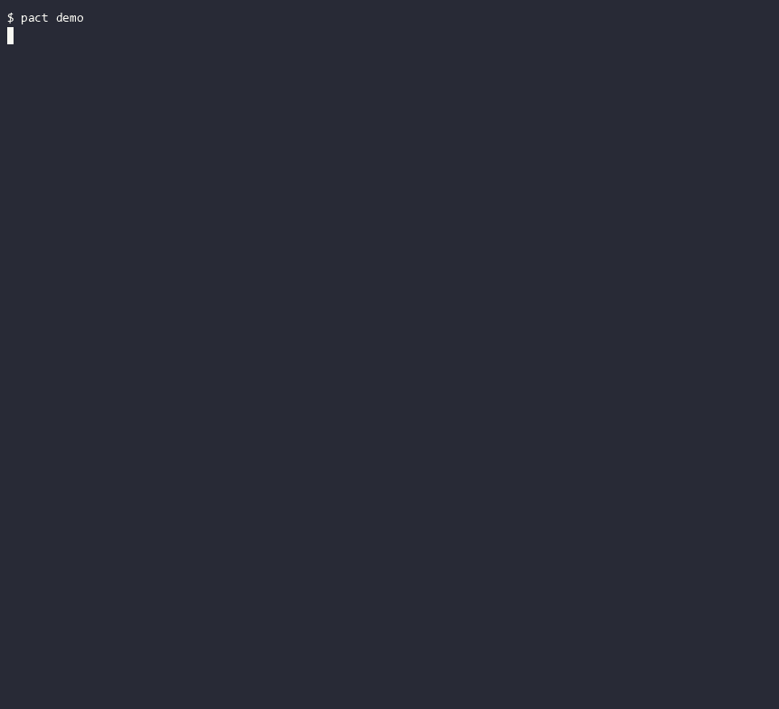
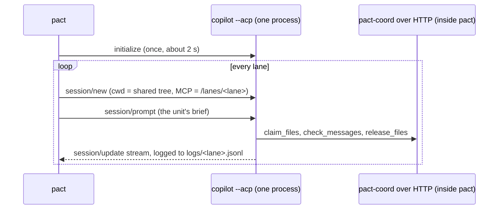

# pact

pact runs several AI coding agents (Claude Code, GitHub Copilot CLI, Codex,
Gemini CLI, Antigravity) on one repository at the same time and hands back
one verified branch. Give it a single task: a planner splits it into units
that own disjoint files, every unit runs as a session inside one shared
agent process, and pact commits the result and checks it against a baseline
of the untouched tree. Nobody writes briefs, and no agent waits on another.



*The real output of `pact demo`: no agent calls, no cost, about five seconds.*

## Getting started

Download a prebuilt binary (no Rust toolchain needed):

```sh
# macOS (Apple Silicon)
curl -L https://github.com/zekariasasaminew/pact/releases/latest/download/pact-aarch64-apple-darwin.tar.gz | tar xz
# macOS (Intel)
curl -L https://github.com/zekariasasaminew/pact/releases/latest/download/pact-x86_64-apple-darwin.tar.gz | tar xz
# Linux (x86_64)
curl -L https://github.com/zekariasasaminew/pact/releases/latest/download/pact-x86_64-unknown-linux-gnu.tar.gz | tar xz
# Homebrew
brew tap zekariasasaminew/pact && brew install pact
```

```powershell
# Windows (x86_64)
Invoke-WebRequest https://github.com/zekariasasaminew/pact/releases/latest/download/pact-x86_64-pc-windows-msvc.zip -OutFile pact.zip
Expand-Archive pact.zip
```

The [`edge` release](https://github.com/zekariasasaminew/pact/releases/tag/edge)
is rebuilt on every push to `main`; use a tagged release for anything you
depend on. Building from source is in [CONTRIBUTING.md](CONTRIBUTING.md).

Then, inside a git repository:

```sh
pact doctor
pact run --agent copilot --verify "npm test" "Add Vitest tests for every module under lib/"
```

[GETTING_STARTED.md](GETTING_STARTED.md) walks through the first run.
Windows is a first-class target: native binary, `.cmd` shim resolution,
live-verified on Windows 10/11.

## How `pact run` works

```mermaid
flowchart TD
    T([task]) --> P[planner session reads the repo]
    T --> S[shared tree, dependencies,<br/>verify baselines on the untouched tree]
    P --> V{plan valid?<br/>disjoint files, unique names,<br/>at most --max-units}
    V -- no, up to --plan-retries --> P
    V -- yes --> B[one brief per unit:<br/>task verbatim, its files, the rules]
    B --> L[lanes run as ACP sessions<br/>in one agent process,<br/>admitted by free memory]
    S --> L
    L --> C[commit once]
    C --> R[run every --verify command]
    R --> D{worst verdict}
    D -- regressed or failed --> X[repair lane in the same tree,<br/>up to --repair-attempts]
    X --> C
    D -- passed, fixed or inconclusive --> O([report + branch])
```

Each verification command runs twice: on the untouched tree before any lane
starts, and on the combined result. The pair decides the verdict:

| before | after | verdict | exit code |
|---|---|---|---|
| passes | passes | passed | 0 |
| fails | passes | fixed | 0 |
| passes | fails | regressed: a repair lane runs | 1 if still failing |
| fails | fails | inconclusive: cannot judge the run | 3 |
| no baseline | fails | failed: a repair lane runs | 1 if still failing |

Workers check only their own files; the project-wide checks run once, by
pact, on the combined result. Twelve lanes each running a full type-check
was the bottleneck pact removed this way (issue #361).

The lanes share one agent process through the
[Agent Client Protocol](https://agentclientprotocol.com) (Copilot CLI's
`copilot --acp`; other agents run one process per lane):


```mermaid
sequenceDiagram
    participant pact
    participant agent as copilot --acp (one process)
    participant coord as pact-coord over HTTP (inside pact)
    pact->>agent: initialize (once, about 2 s)
    loop every lane
        pact->>agent: session/new (cwd = shared tree, MCP = /lanes/<lane>)
        pact->>agent: session/prompt (the unit's brief)
        agent->>coord: claim_files, check_messages, release_files
        agent-->>pact: session/update stream, logged to logs/<lane>.jsonl
    end
```

Useful flags: `--verify <cmd>` (repeatable), `--max-units` (default: what
this machine can run at once), `--max-concurrent`, `--repair-attempts`
(default 1, 0 disables), `--task-file`, `--dry-run` (plan and briefs only),
`--plan <file>` (re-run a saved or edited plan), `--prepare <cmd>`
(regenerate gitignored files such as `next typegen` output), `--runtime
auto|acp|process`.

```sh
pact run --agent copilot --dry-run "Add tests for every module under lib/"
pact run --agent copilot --task-file task.md --verify "npm test" --verify "npm run lint"
pact run --agent copilot --plan saved-plan.json "Add tests for every module under lib/"
```

Plans are saved under the state directory's `meta/plans/`, briefs under
`briefs/`, every lane's event stream under `logs/`.

## Benchmark

One 39-file test-writing task on a Next.js app, same model (claude-opus-5),
same base commit, 12-core 14 GB Windows laptop. Full data and every arm:
issue #308.

| setup | wall clock | peak RAM | mean RAM | cost | coverage |
|---|---|---|---|---|---|
| Copilot CLI's own sub-agents, 8 in one session | 15.8 min | 4.29 GB | 2.22 GB | $16.20 | 98.2% |
| pact, one git worktree per agent plus merge (8 lanes) | 53.6 min | 8.26 GB | 2.45 GB | $23.68 | 98.5% |
| **`pact run`, 8 lanes, shared tree, ACP sessions** | **12.5 min** | **3.17 GB** | **1.13 GB** | **$12.79** | **99.3%** |

Per-agent worktrees were the first cost to go: for units that own disjoint
files, isolation and the merge are pure overhead. One agent process hosting
every lane as a session removed the second (cold process start-up). What
remains is model time and per-lane checks.

## Running agents by hand

When you already know the split, drive the lanes yourself:

```sh
pact spawn --agent claude "Add input validation to the signup form"
pact spawn-many --task claude:"Add a GET /orders endpoint" --task copilot:"Add a GET /preferences endpoint"
pact spawn-many --agent copilot --shared-tree --task "Write tests for lib/" --task "Write tests for app/api/"
pact list
pact diff <id>
pact coord-status
pact history --workspace <id>
pact commit-all
pact merge-all --require-passing-tests "npm test"
pact resolve <id>
pact teardown <id>
```

- `spawn`/`spawn-many` never commit; `commit-all` or `merge-all` does.
- Without `--shared-tree`, each task gets its own git worktree; use that
  when tasks must edit the same files. `merge-all` lands them on a new
  `pact/merged-<id>` branch, smallest change first, with JSON-aware merges
  for `package.json`, `Cargo.toml` and `pyproject.toml` dependency tables,
  and skips (not aborts) a conflicting workspace for `pact resolve`.
- `--dry-run` previews any spawn without creating or launching anything.

Every agent gets seven coordination tools from pact's MCP server
(`claim_files`, `release_files`, `send_message`, `check_messages`,
`request_handoff`, `check_handoffs`, `respond_handoff`). Leases are
advisory: they make overlapping work visible, they do not lock files.

## Configuration

`pact.toml` at the repository root sets defaults; a flag always wins.
`pact init` writes one from what is installed.

```toml
[defaults]
agent = "copilot"
prepare = ["npx next typegen"]
```

| key under `[defaults]` | meaning | default |
|---|---|---|
| `agent` | agent for `run`/`spawn` | detected when exactly one agent CLI is installed |
| `safety` | the adapter's own unattended-safety value | per adapter, below |
| `runtime` | `auto`, `acp` or `process` | `auto` (ACP when every agent supports it) |
| `deps` | `auto` (link the root's `node_modules`), `install`, `none` | `auto` |
| `prepare` | commands run in every new tree after dependencies | none |
| `max_concurrent` | most agents running at once | units planned (`run`), 2 (`spawn-many`) |
| `min_free_mem_mb` | free memory required before another agent starts | 1500 |
| `per_lane_reserve_mb` | memory held back for each running agent | 400 ACP, 1200 process |
| `stagger_ms` | gap between agent launches | 2000 |

## Safety

Headless agents cannot answer permission prompts, so every adapter launches
with an unattended setting, printed as a warning on every launch:

| agent | default | what it can do |
|---|---|---|
| Claude Code | explicit tool allowlist | edit its workspace, run listed tools; anything else is denied cleanly |
| Copilot CLI | `--allow-all-tools` | any command; the lean profile denies installs, builds and dev servers |
| Codex | `--dangerously-bypass-approvals-and-sandbox` | any command, any file your user can reach |
| Gemini CLI | `--approval-mode yolo` | same; adapter not live-verified |
| Antigravity | `--dangerously-skip-permissions` | same |

Agents launch lean by default: none of your own MCP servers load into a
worker (Copilot gets an isolated agent home, Claude Code
`--strict-mcp-config`), so a Copilot worker starts in about 6 s instead of
57 s. `--no-lean` restores the full launch. pact sends no telemetry.

## Limitations

- `pact run` executes one wave: units that depend on each other wait for #282.
- Only Copilot CLI has an ACP mode; other agents run one process per lane.
- Ctrl-C can leave agent processes running (#366).
- Live-agent verification has been on Windows; CI builds and tests on
  Linux, macOS and Windows with fake agents.
- `--agent gemini` is built but not live-verified; `--agent agy` is safe
  one task at a time only.

## Documentation

| file | for |
|---|---|
| [GETTING_STARTED.md](GETTING_STARTED.md) | the first run, step by step |
| [docs/usage.md](docs/usage.md) | every command, the safety model in full, architecture flows, state layout |
| [SKILL.md](SKILL.md) | what an agent reads to drive pact |
| [DESIGN.md](DESIGN.md) | why each decision was made, with the measurements |
| [docs/design/history/readme.md](docs/design/history/readme.md) | the earlier README: roadmap and design notes |
| [CONTRIBUTING.md](CONTRIBUTING.md) | building, testing, the PR workflow |
